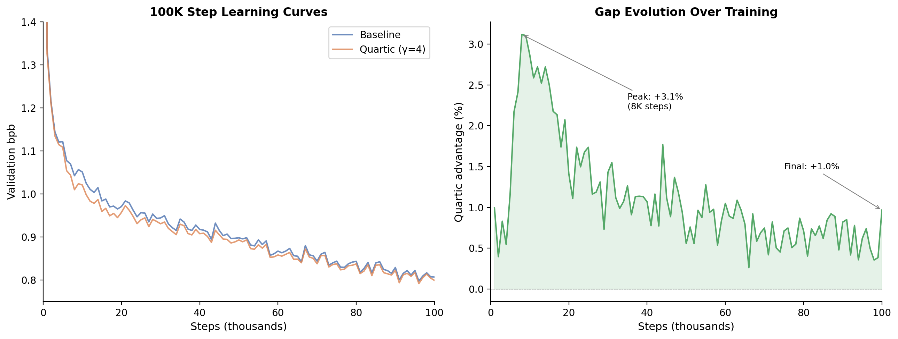
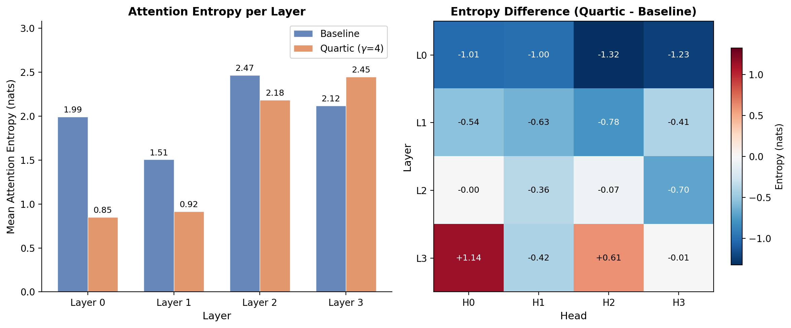
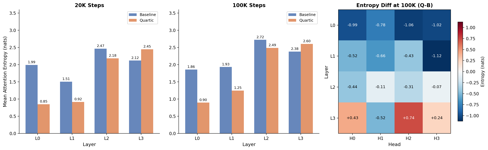

# NeuroGen

**Developmental constraints improve transformer training.**

An [autoresearch](https://github.com/karpathy/autoresearch) project testing whether biologically-inspired developmental principles can improve transformers. Layer-wise attention window growth — forcing early layers to attend locally before opening to global attention — produces statistically significant improvements that persist through extended training and increase with scale. Validated at 3.4M parameters (100K steps, p=0.001) and 125M parameters (50K steps, gap still widening).

## Key Finding

Quartic attention window growth (`window_power_4.0`) improves val_bpb by **+1.5%** at 3.4M (20K steps, p=0.001, Cohen's d=2.05, 5 seeds), **+0.97%** at 3.4M (100K steps, persistent advantage), and **+8.4%** at 125M (50K steps, gap still widening). The mechanism is a **curriculum effect with lasting structural impact**: early local-attention constraints create a compositional hierarchy via reduced parameter coupling, and this hierarchy persists permanently — confirmed by attention entropy measurements at both 20K and 100K steps.

```
Layer windows at depth 4:  [8, 10, 65, 256]       (3.4M model)
Layer windows at depth 12: [16, 16, 16, ..., 1024] (125M model, quartic growth)

- Early layers: restricted to local context
- Final layer: full attention
```

### 3.4M Results

**Statistical validation (20K steps, 5 seeds):**

```
config                  mean bpb   std      vs baseline   p-value   Cohen's d
baseline                0.9002     0.0075   —             —         —
window_power_4.0        0.8866     0.0056   +1.5%         0.001     2.05
window_quadratic        0.8911     0.0048   +1.0%         0.022     1.45
window_quad_induction   0.8899     0.0041   +1.1%         0.007     1.69

All 5 seeds of every window variant beat the baseline mean.
Throughput identical: 4.8 steps/sec on M1 Pro.
```

**Extended training (100K steps, seed 42) — the advantage persists:**

```
step     baseline   quartic    gap        note
1k       1.3394     1.3261     +0.99%
5k       1.1216     1.1086     +1.16%
10k      1.0512     1.0210     +2.87%     ← peak gap (curriculum effect strongest)
20k      0.9709     0.9572     +1.41%
50k      0.8983     0.8933     +0.56%
100k     0.8072     0.7994     +0.97%     ← advantage persists at convergence

Best seen: quartic 0.7921 (96k) vs baseline 0.7980 (96k)
```

The developmental constraint accelerates hierarchy formation early (peak +2.87% at 10K) and the advantage narrows but **never closes** through 100K steps. Attention spans at 100K confirm quartic early layers use only ~2-3 of their allowed tokens — genuine learned locality, not just a mask:

```
Baseline 100K:  [8/256, 12/256, 22/256, 15/256]   (all layers diffuse)
Quartic 100K:   [2/8,   3/23,  11/86,  29/256]    (early layers tightly local)
```




### 125M Scaling (50K steps, H100)

The advantage **grows with scale** and **grows with training** — not just faster convergence:

```
step     baseline   quartic    gap
5k       4.917      4.817      +2.0%
10k      4.596      4.416      +3.9%
20k      4.090      3.989      +2.5%
30k      3.783      3.651      +3.5%
40k      3.429      3.231      +5.8%
50k      3.345      3.065      +8.4%   ← gap still widening, neither converged

Throughput: quartic 2.84 sps vs baseline 2.78 sps (windows are faster with Flash Attention)
```


### Generation Samples (100K steps)

We generated 240 stories per model (12 prompts x 20 seeds) from the 100K-step checkpoints. Both models are 3.4M params on TinyStories — at this scale, qualitative differences are modest. Aggregate metrics across all 240 samples:

```
metric                Baseline     Quartic     note
mean words/sample       31.2        30.3
vocab diversity         0.789       0.801       +1.5% (quartic more varied)
3-gram repetition       0.011       0.015       (both very low)
```

The most visible difference appears in specific failure modes. When baseline fails, it tends toward **repetitive phrase loops**; quartic's failures are more varied. Selected contrasting examples (best-of-5 seeds per prompt):

> **Prompt: "The dog found a big red"**
>
> **Baseline:** ball. The dog was happy to play with the ball. **The dog wagged his tail** and licked the dog's ears. **The dog wagged its tail** and barked happily. **The dog wagged its tail** and barked happily. The dog ran to catch the dog...
>
> **Quartic:** ball of yarn in his mouth. He bit it and made a loud noise. The blue ball rolled into the ball. The ball was sad.

> **Prompt: "Mom said we could go to the"**
>
> **Baseline:** park and play on **the swings**. But they had to be quiet and careful. They wished they could go to the park and see the trees and the flowers. They were careful not to fall off **the swings and the slide**. They loved to play on **the swings and the slide**...
>
> **Quartic:** park to play with it. Tim liked the park better, so he grabbed the trunk and put it on the swingsing.

> **Prompt: "Once upon a time there was a"**
>
> **Baseline:** little girl called Lucy. She was three years old and she loved to play with **her toys**. One day, Lucy was playing with **her toys** and she wanted to play with her friends. She thought it was the best **toy** ever!
>
> **Quartic:** little girl who liked to explore. One day she went to the beach with her mum and dad. She was very excited and asked for a new boat.

> **Prompt: "Tom was very sad because"**
>
> **Baseline:** he could not play on the swings and the slide. *(stops — 10 words)*
>
> **Quartic:** he really wanted to go to the market. His mom was very kind and said that Tom needed help. *(continues into full narrative — 19 words)*

Note: these are cherry-picked contrasting pairs. On most seeds, both models produce similar-quality TinyStories output. The real evidence for the quartic advantage is the bpb improvement and the attention entropy analysis, not generation quality at 3.4M scale.

Full 240-sample comparison: [`samples/all_20_samples.txt`](samples/all_20_samples.txt) | Best-of-5 ranked pairs: [`samples/best_of_5_comparison.txt`](samples/best_of_5_comparison.txt)

## How It Works

A standard transformer uses full attention at every layer. NeuroGen restricts each layer's attention window based on depth, forcing early layers to build local features before later layers integrate globally:

```python
def compute_window(layer_idx, n_layers, seq_len, exponent=4.0):
    progress = (layer_idx + 1) / n_layers
    return int(base + progress ** exponent * (seq_len - base))
```

The window function was found through systematic search across power functions (exponents 0.5-12.0), sigmoid curves, logarithmic, exponential, and Fibonacci schedules. The optimal exponent is 3-4 at depth 4.

## Attention Entropy Analysis

Direct measurement of attention entropy confirms forced specialization **persists through extended training**:





```
         --- 20K Steps ---              --- 100K Steps ---
Layer    Baseline  Quartic  Change      Baseline  Quartic  Change
L0       1.994     0.852    −57.3%      1.860     0.898    −51.7%  ← stays focused
L1       1.506     0.916    −39.2%      1.933     1.248    −35.4%
L2       2.466     2.183    −11.5%      2.722     2.489    −8.6%
L3       2.120     2.449    +15.5%      2.382     2.605    +9.4%   ← stays diffuse
```

Early layers (L0–L1) maintain **~44% lower entropy** even at 100K steps — the specialization created by attention windows is permanent, not a transient training artifact. The final layer compensates with slightly higher entropy, using its full attention span to integrate globally over the local features built below.

## Mechanism

Seven experiments tested why attention windows improve training:

**Experiment 1 — Gradient quality vs window size:** On a frozen trained checkpoint, measured gradient SNR across 10 window sizes. Gradient noise is **constant** (~0.0053) regardless of window size. What changes is **signal coherence** — signal norm increases 18x from window 256 to window 8. Windows don't remove noise; they make gradients point in a more consistent direction.

**Experiment 2 — Gradient decomposition:** Decomposed the softmax backward pass into contributions from attended vs non-attended positions. Noise fraction is only **4-7%** across all layers — the softmax coupling introduces minimal gradient contamination.

**Experiment 3 — Variance reduction control:** If windows work by reducing gradient variance, larger batch sizes should replicate the effect. They don't.

```
Same optimizer steps (2000), 3 seeds each:

config                eff batch   mean bpb   tokens     vs baseline
baseline (full attn)       32      1.2439      16M        —
quartic windows            32      1.2143      16M       +2.4%
full attn, batch 128      128      1.0840      66M      +12.9%
full attn, batch 256      256      1.0331     131M      +17.0%

Token-matched comparison (at 16M tokens seen):
  quartic windows:    1.214  ← best
  baseline:           1.244
  batch 128 (step500): 1.352  ← worse than baseline

Larger batch models look better only because they saw 4-8x more data.
At equal token budget, windows win and larger batch loses.
```

**Experiment 4 — Train-val gap:** Quartic models have a slightly *larger* gap than baseline, opposite of the regularization prediction. Windows are **not** acting as implicit regularization.

**Experiment 5 — Gradient covariance rank:** Effective rank drops from 48.4 (full attention) to 14.7 (window 8). At window 8, 97.7% of gradient variance is in the top component. Windows **dramatically reduce parameter coupling**.

**Experiment 6 — Trained model landscape:** Quartic-trained models have slightly *lower* gradient stability than baseline (0.109 vs 0.139). Windows do **not** produce a smoother optimization landscape.

**Experiment 7 — Remove windows mid-training (decisive test):** Train with quartic for 10k steps, then switch to full attention for 10k more. Result: removing windows preserves the full benefit.

```
config                          mean bpb    vs baseline
A: Full attention (20k steps)    0.8977      —
B: Quartic windows (20k steps)   0.8858      +1.33%
F: Quartic 10k → Full 10k       0.8842      +1.50%

F is slightly *better* than B: removing windows after 10k steps finds a better solution than keeping them, strengthening the curriculum interpretation. Seed 256 Config F diverged (NaN) after window removal; results from seeds 42 and 137 only.
```

**What we ruled out (7 experiments):**
- Gradient noise removal (noise constant — Exp 1)
- Softmax coupling contamination (4-7% — Exp 2)
- Variance reduction (batch size can't replicate — Exp 3)
- Implicit regularization (quartic has larger train-val gap — Exp 4)
- Optimization landscape smoothness (quartic slightly less stable — Exp 6)
- Ongoing structural constraint (removing windows preserves benefit — Exp 7)

**What the data supports:**
- **Curriculum effect with lasting structural impact.** Windows during early training force a local-to-global learning order that creates a compositional hierarchy. This hierarchy persists after windows are removed — the model doesn't unlearn it. The reduced parameter coupling (Exp 5) is likely the mechanism by which the early constraint shapes the hierarchy.
- **Inductive bias toward compositionality** remains consistent but is not independently testable with current experiments.

## Research Journey

This project ran 200+ autonomous experiments across 5 phases:

- **Round 1** (50 experiments): CA weight initialization gives ~0.8% improvement. Live CA fails on MPS due to overhead.
- **Round 2** (40 experiments): CA init advantage holds at 30min training (constant offset, not head start).
- **Round 4** (68 experiments): Tested 26 architecture variants including CA modulation channels, embryogenic CA, universal circuit pre-wiring, token vitality, sleep consolidation. Most failed. Developmental attention windows emerged as the clear winner.
- **Validation** (20 experiments): Confirmed at 20k steps with 5 seeds. Statistically significant. Throughput-neutral.
- **125M scaling** (15 experiments): Validated at GPT-2 scale on H100. Advantage grows from +2% to +8.4% over 50k steps.
- **Mechanism** (7 experiments): Gradient analysis eliminates six mechanism hypotheses. Identifies curriculum effect with lasting structural impact via reduced parameter coupling.

### What Didn't Work
- CA modulation channels (model collapse)
- Token vitality / cell death dynamics (model collapse)
- Sleep consolidation (overhead outweighed benefit)
- Pre-wiring known circuits alone (induction heads, layer roles — gradient descent prefers organic discovery)
- Live CA during training (any per-step overhead hurts at small scale)
- Embryogenic activity-dependent CA (marginal gains, high overhead)

### What Did Work
- **Developmental attention windows** (quartic growth, +1.5% at 3.4M, +8.4% at 125M)
- **Combining constraints with scaffolds** (window + induction pre-wiring, +1.1%)
- **Block-diagonal CA init** (+0.6% at 10min, constant offset)

## Quick Start

### 3.4M model (Apple Silicon / CPU)

```bash
# Install
curl -LsSf https://astral.sh/uv/install.sh | sh
uv sync

# Download data (TinyStories, ~50MB)
uv run prepare.py

# Train baseline
uv run train_r4.py --arch baseline --minutes 40 --seed 42

# Train with quartic windows (best config)
uv run train_r4.py --arch window_power_4.0 --minutes 40 --seed 42

# Step-budget validation (eliminates throughput confounds)
uv run validate.py --arch window_power_4.0 --steps 20000 --seed 42
```

### 125M model (CUDA / H100)

```bash
pip install torch numpy datasets tiktoken flash-attn

# Download data (FineWeb-Edu, ~100M tokens)
python train_125m.py --prepare

# Throughput audit (verify equal speed across configs)
python train_125m.py --throughput

# Train single run
python train_125m.py --arch window_power_4.0 --steps 50000 --seed 42

# Generate text from checkpoint
python train_125m.py --generate checkpoints_125m/window_power_4.0_s42.pt

# Compare models side-by-side
python train_125m.py --compare checkpoints_125m/baseline_s137.pt checkpoints_125m/window_power_4.0_s137.pt
```

### Mechanism experiments (Apple Silicon / CPU)

```bash
# Exp 1-3: gradient analysis (~2.5 hours)
uv run experiment_gradient.py --all

# Exp 4-6: disambiguation (~45 min)
uv run experiment_mechanism.py --exp4 --exp5 --exp6

# Exp 7: curriculum test (~3 hours)
uv run experiment_mechanism.py --exp7

# Cross-scale analysis with figures
uv run analyze_all.py
```

## Project Structure

```
# Training
prepare.py              — data prep + tokenizer (3.4M, TinyStories)
train_r4.py             — 3.4M model with 26 architecture variants
validate.py             — step-budget convergence runs with diagnostics
train_125m.py           — 125M model (GPT-2 small) for H100
ca_rules.py             — CA rule library

# Mechanism experiments
experiment_gradient.py  — experiments 1-3 (gradient quality, decomposition, variance)
experiment_mechanism.py — experiments 4-7 (regularization, coupling, landscape, curriculum)

# Analysis
analyze_125m.py              — 125M statistical analysis
analyze_all.py               — cross-scale analysis with figures
analyze_attention_entropy.py — per-layer attention entropy (20K)
analyze_entropy_100k.py      — entropy persistence analysis (20K vs 100K)
evaluate_quality.py          — generation quality metrics
interact.py                  — interactive inference (type prompts, see both models)

# Data
validation_results/     — convergence data (100K + 20K × 5 seeds × 4 configs)
results_125m/           — 125M results (50K steps × 2 seeds)
gradient_results/       — mechanism experiment data (7 experiments + entropy)
samples/                — 480 generation samples (12 prompts × 20 seeds × 2 models)
charts/                 — figures for README and paper
papers/                 — paper (LaTeX + PDF)
```

## Hardware

- **3.4M model**: Apple Silicon (MPS), ~4.8 steps/sec on M1 Pro. Also works on CUDA and CPU.
- **125M model**: NVIDIA H100 80GB, ~2.8 steps/sec. Uses Flash Attention with native sliding window support.

## References

- [nanochat](https://github.com/karpathy/nanochat) / [autoresearch](https://github.com/karpathy/autoresearch) — Karpathy. Training harness and experiment loop.
- [HyperNCA](https://arxiv.org/abs/2204.11674) — Najarro & Risi, 2022. NCA growing RL policy weights.
- [Growing Neural Cellular Automata](https://distill.pub/2020/growing-ca/) — Mordvintsev et al., 2020.
- Olsson et al., 2022 — In-context learning and induction heads.

## Paper

Preprint: https://doi.org/10.5281/zenodo.19642188

## License

MIT
