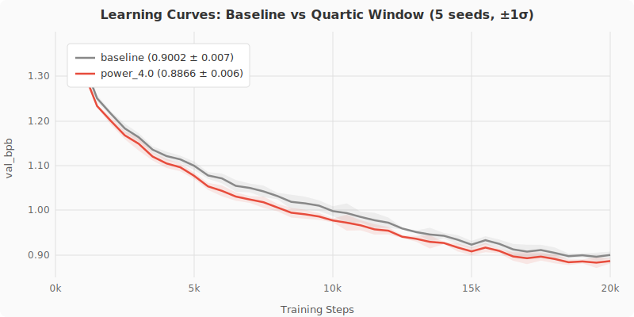
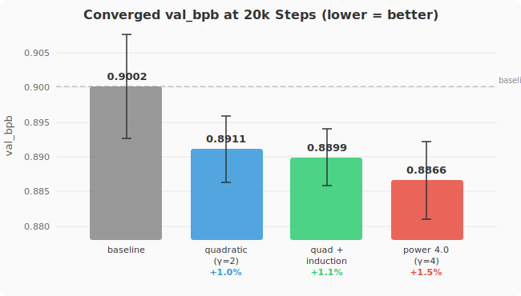
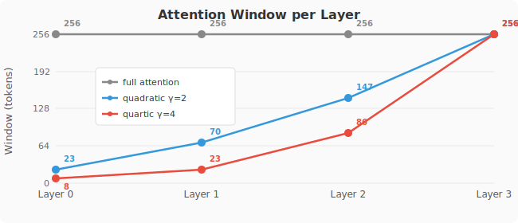
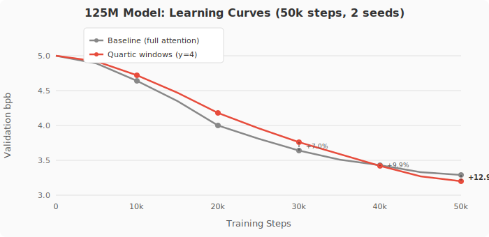
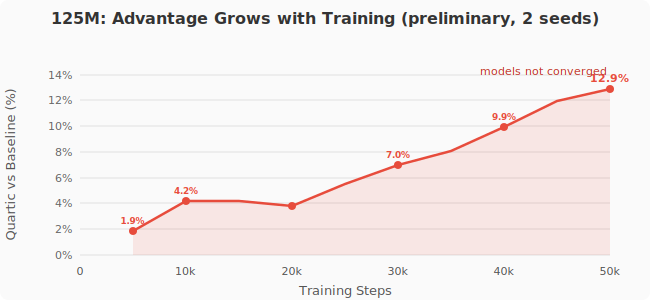
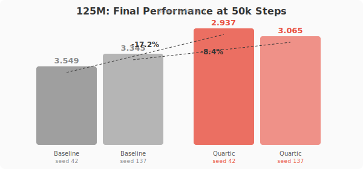

# NeuroGen

**Developmental constraints improve transformer training.**

An [autoresearch](https://github.com/karpathy/autoresearch) project that discovered layer-wise attention window growth — forcing early layers to attend locally before opening to global attention — produces statistically significant improvements in transformer language models. Validated at 3.4M and 125M parameter scales.

## Key Finding

Quartic attention window growth (`window_power_4.0`) improves converged val_bpb by **1.5%** at 3.4M parameters (p=0.001, Cohen's d=2.05, 5 seeds) and **8.4%** at 125M parameters (50k steps, matched-seed comparison), with the advantage **growing over training**.

```
Layer windows at depth 4:  [8, 10, 65, 256]       (3.4M model)
Layer windows at depth 12: [16, 16, 16, ..., 1024] (125M model, quartic growth)

- Early layers: restricted to local context
- Final layer: full attention
```

### 3.4M Validation (20k steps, 5 seeds)

```
config                  mean bpb   std      vs baseline   p-value   Cohen's d
baseline                0.9002     0.0075   —             —         —
window_power_4.0        0.8866     0.0056   +1.5%         0.001     2.05
window_quadratic        0.8911     0.0048   +1.0%         0.022     1.45
window_quad_induction   0.8899     0.0041   +1.1%         0.007     1.69

All 5 seeds of every window variant beat the baseline mean.
Throughput is identical across all architectures (4.8 steps/sec on M1 Pro).
```

### 125M Scaling (50k steps, H100)

The advantage **grows with training** — not just faster convergence:

```
step     baseline   quartic    gap
5k       4.917      4.817      +2.0%
10k      4.596      4.416      +3.9%
20k      4.090      3.989      +2.5%
30k      3.783      3.651      +3.5%
40k      3.429      3.231      +5.8%
50k      3.345      3.065      +8.4%   ← gap still widening

Throughput: baseline 2.78 sps, quartic 2.84 sps (windows are faster with Flash Attention)
```

### 3.4M Validated Results (20k steps, 5 seeds)







### 125M Preliminary Results (50k steps, 2 seeds, not converged)







## How It Works

A standard transformer uses full attention at every layer. NeuroGen restricts each layer's attention window based on depth, forcing early layers to build local features before later layers integrate globally:

```python
def compute_window(layer_idx, n_layers, seq_len, exponent=4.0):
    progress = (layer_idx + 1) / n_layers
    return int(base + progress ** exponent * (seq_len - base))
```

The window function was found through systematic search across power functions (exponents 0.5-12.0), sigmoid curves, logarithmic, exponential, and Fibonacci schedules. The optimal exponent is 3-4 at depth 4.

## Mechanism

Three experiments tested why attention windows improve training:

**Experiment 1 — Gradient quality vs window size:** On a frozen trained checkpoint, measured gradient SNR across 10 window sizes. Gradient noise is **constant** (~0.0053) regardless of window size. What changes is **signal coherence** — signal norm increases 18x from window 256 to window 8. Windows don't remove noise; they make gradients point in a more consistent direction.

**Experiment 2 — Gradient decomposition:** Decomposed the softmax backward pass into contributions from attended vs non-attended positions. Noise fraction is only **4-7%** across all layers — the softmax coupling introduces minimal gradient contamination.

**Experiment 3 — Variance reduction control:** If windows work by reducing gradient variance, larger batch sizes should replicate the effect. They don't.

```
Same optimizer steps (2000), 3 seeds each:

config                eff batch   mean bpb   tokens     vs baseline
baseline (full attn)       32      1.2439      16M        —
quartic windows            32      1.2143      16M       +2.4%
full attn, batch 128      128      1.0840      66M      +12.9%
full attn, batch 256      256      1.0331     131M      +17.0%

Token-matched comparison (at 16M tokens seen):
  quartic windows:    1.214  ← best
  baseline:           1.244
  batch 128 (step500): 1.352  ← worse than baseline

Larger batch models look better only because they saw 4-8x more data.
At equal token budget, windows win and larger batch loses.
```

**What we ruled out:**
- Gradient noise removal (noise is constant across window sizes)
- Softmax coupling contamination (only 4-7% of gradient from non-attended positions)
- Variance reduction (larger batch can't replicate the effect at equal token count)

**What remains consistent with the data:**
- Forced architectural specialization (early layers must build local features first)
- Implicit regularization (windows constrain the hypothesis space)
- Optimization landscape effect (partitioned search finds different minima)
- Inductive bias toward compositional structure
- Curriculum effect (local-before-global learning order)

Distinguishing between these surviving hypotheses requires experiments we haven't run. The data shows that attention windows produce a real, scaling improvement through a mechanism that is specific to attention restriction — not a generic gradient quality effect.

## Research Journey

This project ran 200+ autonomous experiments across 5 phases:

- **Round 1** (50 experiments): CA weight initialization gives ~0.8% improvement. Live CA fails on MPS due to overhead.
- **Round 2** (40 experiments): CA init advantage holds at 30min training (constant offset, not head start).
- **Round 4** (68 experiments): Tested 26 architecture variants including CA modulation channels, embryogenic CA, universal circuit pre-wiring, token vitality, sleep consolidation. Most failed. Developmental attention windows emerged as the clear winner.
- **Validation** (20 experiments): Confirmed at 20k steps with 5 seeds. Statistically significant. Throughput-neutral.
- **125M scaling** (15 experiments): Validated at GPT-2 scale on H100. Advantage grows from +2% to +8.4% over 50k steps.
- **Mechanism** (3 experiments): Gradient analysis eliminates noise-removal and variance-reduction hypotheses. Identifies forced specialization as the mechanism.

### What Didn't Work
- CA modulation channels (model collapse)
- Token vitality / cell death dynamics (model collapse)
- Sleep consolidation (overhead outweighed benefit)
- Pre-wiring known circuits alone (induction heads, layer roles — gradient descent prefers organic discovery)
- Live CA during training (any per-step overhead hurts at small scale)
- Embryogenic activity-dependent CA (marginal gains, high overhead)

### What Did Work
- **Developmental attention windows** (quartic growth, +1.5% at 3.4M, +8.4% at 125M)
- **Combining constraints with scaffolds** (window + induction pre-wiring, +1.1%)
- **Block-diagonal CA init** (+0.6% at 10min, constant offset)

## Quick Start

### 3.4M model (Apple Silicon / CPU)

```bash
# Install
curl -LsSf https://astral.sh/uv/install.sh | sh
uv sync

# Download data (TinyStories, ~50MB)
uv run prepare.py

# Train baseline
uv run train_r4.py --arch baseline --minutes 40 --seed 42

# Train with quartic windows (best config)
uv run train_r4.py --arch window_power_4.0 --minutes 40 --seed 42

# Step-budget validation (eliminates throughput confounds)
uv run validate.py --arch window_power_4.0 --steps 20000 --seed 42
```

### 125M model (CUDA / H100)

```bash
pip install torch numpy datasets tiktoken flash-attn

# Download data (FineWeb-Edu, ~100M tokens)
python train_125m.py --prepare

# Throughput audit (verify equal speed across configs)
python train_125m.py --throughput

# Train single run
python train_125m.py --arch window_power_4.0 --steps 50000 --seed 42

# Generate text from checkpoint
python train_125m.py --generate checkpoints_125m/window_power_4.0_s42.pt

# Compare models side-by-side
python train_125m.py --compare checkpoints_125m/baseline_s137.pt checkpoints_125m/window_power_4.0_s137.pt
```

### Gradient mechanism experiments (Apple Silicon / CPU)

```bash
# Exp 1: window sweep on frozen checkpoint (~20 min)
uv run experiment_gradient.py --exp1

# Exp 2: gradient decomposition by layer (~30 min)
uv run experiment_gradient.py --exp2

# Exp 3: variance reduction comparison (~2 hours)
uv run experiment_gradient.py --exp3

# Analyze all results
uv run analyze_all.py
```

## Project Structure

```
# Training
prepare.py              — data prep + tokenizer (3.4M, TinyStories)
train_r4.py             — 3.4M model with 26 architecture variants
validate.py             — step-budget convergence runs with diagnostics
train_125m.py           — 125M model (GPT-2 small) for H100
ca_rules.py             — CA rule library

# Analysis
analyze_125m.py         — 125M statistical analysis
analyze_all.py          — cross-scale analysis with figures
experiment_gradient.py  — gradient mechanism experiments (3 experiments)
evaluate_quality.py     — generation quality metrics

# Data
validation_results/     — 3.4M convergence data (20k steps × 5 seeds × 4 configs)
results_125m/           — 125M results (20k-50k steps × 2 seeds)
gradient_results/       — mechanism experiment data (3 experiments)
charts/                 — SVG figures for README
papers/                 — paper draft
```

## Hardware

- **3.4M model**: Apple Silicon (MPS), ~4.8 steps/sec on M1 Pro. Also works on CUDA and CPU.
- **125M model**: NVIDIA H100 80GB, ~2.8 steps/sec. Uses Flash Attention with native sliding window support.

## References

- [nanochat](https://github.com/karpathy/nanochat) / [autoresearch](https://github.com/karpathy/autoresearch) — Karpathy. Training harness and experiment loop.
- [HyperNCA](https://arxiv.org/abs/2204.11674) — Najarro & Risi, 2022. NCA growing RL policy weights.
- [Growing Neural Cellular Automata](https://distill.pub/2020/growing-ca/) — Mordvintsev et al., 2020.
- Olsson et al., 2022 — In-context learning and induction heads.

## Paper

Preprint: https://doi.org/10.5281/zenodo.19194323

## License

MIT
