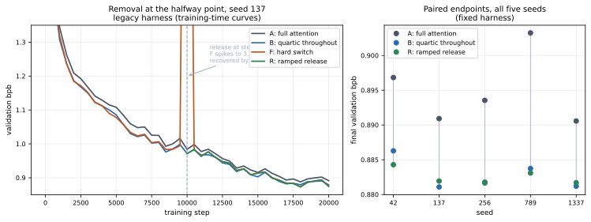
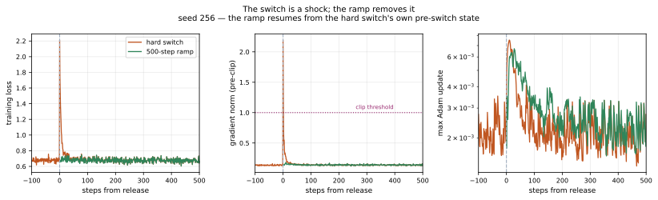
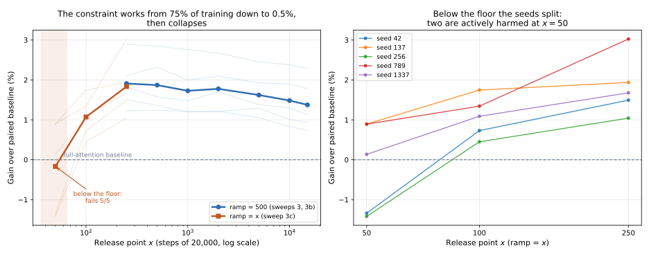
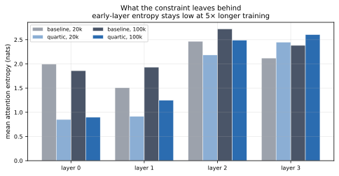
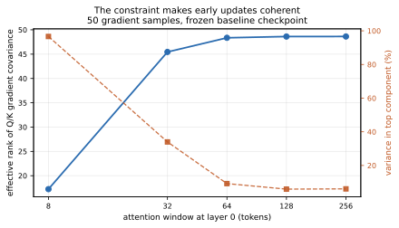
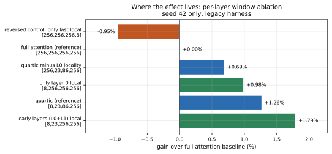
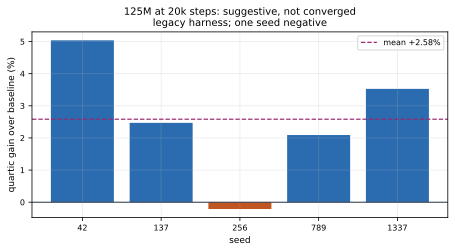

# NeuroGen

**Early-layer attention locality is a transient requirement, not an architectural one.**

An [autoresearch](https://github.com/karpathy/autoresearch) project. Restricting early transformer layers to a local attention window and letting later layers attend globally is well-established prior art — **this repo does not claim it**. What it tests is *when* the constraint is needed, and for *how long*. Answer: only at the very start, and only briefly. Applying quartic attention windows for **250 of 20,000 steps** — 1.25% of training, fully released by step 750 — gives the largest effect measured here, **+1.75%** (500-step ramp; the ramp-scaled arm at the same release point gives +1.68%), and it persists to convergence. But the window has a floor as well as a ceiling: at 100 steps the benefit falls to +0.96%, and at 50 steps it is gone (−0.20%, 2/5 seeds, [not claimed](#the-floor-a-minimum-duration-exists)). The locality prior belongs in the training recipe, not in the deployed architecture — applied briefly, but not too briefly.

> **Which harness a number comes from.** This repo has two evaluation harnesses: the legacy one resamples 12 batches per call, the fixed one scores a deterministic 1M-token set. They are not comparable. **The fixed harness is canonical wherever a fixed value exists** — every 3.4M 20K arm, baseline and quartic included. Legacy values survive only where no checkpoint exists to re-measure (the quadratic/induction variants, the per-layer ablation, the 100K trace, all 125M results) and are labelled *legacy harness* where they appear. No table or comparison mixes the two. Adopting this moved the headline from +1.91% to +1.75% and left every criterion outcome unchanged.

## What's known vs. what's new

**Known (not our claim).** Lower layers want a restricted attention range and upper layers need global context. Models *learn* this profile when span is made trainable ([Sukhbaatar et al., ACL 2019](https://arxiv.org/abs/1905.07799)); ablations confirm it ([Rae & Razavi 2020](https://arxiv.org/abs/2007.03356)); MSWA imposes it as a shallow→deep window ramp and reports quality *and* efficiency gains ([Xu et al. 2025](https://arxiv.org/abs/2501.01039)); Mistral and Gemma ship local-global hybrids in production ([Jiang et al. 2023](https://arxiv.org/abs/2310.06825), [Gemma 3](https://arxiv.org/abs/2503.19786)). Experiment 8 below reproduces this and adds nothing to it.

In all of that work the locality is a property **of the model** — present at init, during training, and at inference.

**New (our claim).** It is a **transient** property of early training. Release the windows — at any point from 75% of training down to 0.5% — and the benefit stays. Within that range shorter is better down to 1.25%, after which it reverses: the constraint has a **minimum duration**, and applying it for 50 steps is worse than never applying it at all. None of the prior art above tests that — SWAT trains *with* windows to keep them at inference, and Shortformer is a curriculum over sequence length staged across much of training, not a brief constraint on per-layer span.

⚠️ **But the surrounding claim is no longer unexamined at scale, and this section used to imply it was.** [Learning Less Is More](https://arxiv.org/abs/2605.10504) (2026) reports the same *shape* of result at **270M and 0.7B**: a transient early intervention on attention, released partway through training, whose benefit persists to the end. Their mechanism is different — and close to a mirror image of ours. They multiply the learning rate of **upper-half** W_Q/W_K by 0.25, hold it there for ~4% of training, then anneal back to 1.0 over the next 1% of steps. No attention window or mask is used anywhere in that work; all attention stays full causal. Constraining early layers with a window and throttling upper layers with a learning rate are two routes to the same stated diagnosis: **upper layers commit to sharp attention before lower-layer features have stabilised.** They report −0.497 ± 0.079 perplexity at 270M and 13.2% fewer tokens to match the control's final loss, over 3 seeds, with no formal significance test.

So what is left unclaimed here is narrower than "nobody has tested transient attention shaping": it is the **windowed** form of it — a depth-wise local mask on early layers, applied for ~1% of training and then released — together with the release-point curve and the floor below it. The family-level finding has independent support at ~80–200× our scale, which is corroboration rather than a scoop, but the README should not have been implying the question was untouched.

**Scope.** Demonstrated at 3.4M on TinyStories, 5 matched seeds, criteria pre-registered. **Not yet tested above 3.4M** — see [Status](#status).

## Key Finding — the windows can be removed



Four arms, 20K steps each, same seed → same init *and* same data order. Only the attention mask differs.
Arm **A** full attention throughout · arm **B** quartic windows throughout · arm **F** quartic for 10K then full attention · arm **R** quartic for 10K then a 500-step ramp to full.

```
seed   A: full   B: quartic  R: ramp    B vs A   R vs A
42     0.8968    0.8863      0.8843     +1.18%   +1.40%
137    0.8909    0.8811      0.8819     +1.10%   +1.01%
256    0.8935    0.8818      0.8817     +1.32%   +1.33%
789    0.9032    0.8837      0.8831     +2.16%   +2.23%
1337   0.8906    0.8812      0.8817     +1.05%   +1.00%

mean   0.8950    0.8828      0.8825     +1.36%   +1.40%   (n=5)

B vs A:  5/5 positive, perm 1/32 = 0.031, paired_t 0.0028, dz 2.92   → CLAIMED
R vs A:  5/5 positive, perm 1/32 = 0.031, paired_t 0.0037, dz 2.72   → CLAIMED
R vs B:  3/5 positive, perm 0.344,        paired_t 0.610,  dz 0.25   → not claimed here
                                                    (but claimed at earlier release points — see below)

Fixed harness. Arm F (hard switch) is omitted: seed 42's checkpoint predates
the checkpoint-saving change, so F is n=4 and cannot reach p<0.05 by construction.
```

Arm **F** drops the windows at once at step 10K; arm **R** widens them to full linearly over 500 steps.

**What this supports:** F beats A on **all five** seeds (permutation test at its floor, p = 0.031; paired-t 0.0064; dz 2.34). The benefit of the locality constraint *survives its removal* — the windows are not doing ongoing work in the second half of training. Arm R, releasing the constraint gradually instead, is indistinguishable from F and also beats A on all five (+1.48%, p = 0.031). **How** the constraint is released doesn't matter for quality; **that** it is released is the claim. All criteria were fixed before the runs.

**What this does NOT support:** that removal is *better* than keeping the windows. Only 2/5 seeds favour it, the mean is −0.05%, and dz ≈ 0. This isn't a near miss — the difference is an order of magnitude below the 0.0023 bpb residual noise on this comparison. **More seeds won't fix it; a lower-variance endpoint measurement would** (see [pre-registered experiment 4](#pre-registered-experiments)). ✅ **That measurement has since been made, and it settles this** — see [the matched comparison](#the-matched-comparison). At *this* release point there is indeed no difference. At every earlier release point releasing does beat retaining, 5/5, which the legacy harness was too noisy to see. An earlier draft, working from the 2 seeds that completed in an earlier 3-seed run, read F's `+1.50%` against B's `+1.33%` as evidence that windows eventually become a ceiling. Those two seeds disagreed in sign; the reading did not survive replication.

Reproduce: `uv run python analyze_exp7.py`

**The switch is a shock, and the divergence is stochastic.** An earlier 3-seed run lost arm F at seed 256 to NaN. It is tempting to read that as a property of seed 256; it isn't. In the 5-seed replication above that *same* seed completed normally at 0.8865, and **no seed diverged**. Observed rate across both runs: **1 divergence in 8 completed arm-F runs**, tied to no seed.

What every run takes is a large transient shock. Per-step instrumentation around step 10000, across all five seeds:

```
                       pre-switch   at switch    peak (first 100)   by step 10400
loss                   0.68         2.21-2.37    —                  0.67
grad norm (pre-clip)   0.136        2.13-2.72    —                  0.136
max Adam update        3.5e-3       3.6e-3       7.5-7.6e-3         3.3e-3
```

The peak Adam update is **2.13–2.16× pre-switch on every one of the five seeds** — a 1.4% spread. That consistency is what makes it a usable diagnostic, where the divergence itself (1 in 8) is not.



**Which part of the switch causes which part of the shock.** Five treatments, all resumed from one identical pre-switch state (seed 256), so they differ only in the intervention:

```
treatment              peak loss   peak gnorm   peak Adam upd   recovery
unmodified switch      2.2112      2.193        7.54e-3         28 steps
masked-softmax control 2.2112      2.193        7.54e-3         28 steps
optimizer reset        2.2112      2.193        1.56e-3         68 steps
200-step LR re-warmup  2.2424      2.193        1.90e-3         72 steps
500-step window ramp   0.7490      0.181        6.71e-3          1 step
(pre-switch reference) 0.68        0.136        3.53e-3          —
```

- **(i) kernel change — eliminated.** The masked-softmax control agrees with the unmodified switch to 1e-6 (the log's rounding precision) at all 501 traced steps. *Caveat:* MPS `scaled_dot_product_attention` appears to dispatch to the same arithmetic as the explicit path, so this may not transfer to a genuinely fused CUDA kernel.
- **(ii) stale Adam second moment — confirmed as the amplifier.** Optimizer reset leaves loss and gradient spikes untouched but cuts the peak update 4.8×, below its pre-switch value (a fresh Adam has `m̂/√v̂ ≈ ±1` on step 1, bounding the update near the LR itself).
- **(iii) softmax denominator jump — confirmed as the source.** Ramping the windows over 500 steps widens the denominator gradually and **removes the shock rather than absorbing it**: loss spike 3.3× → 1.1×, gradient spike 12× smaller and *below the 1.0 clip threshold*, so no clipping fires at all.

The two absorbing interventions trade update magnitude for time — both cut the peak update ~4× but leave the model shocked ~2.5× longer (28 → ~70 steps). The ramp pays neither cost and reaches the same loss (0.6626 vs 0.6627 at step 10500).

**The ramp is free.** The five treatments above are single-seed probes stopped 1000 steps after the switch, so they say nothing about converged quality. Arm R in the table above closes that: run to 20K at all five seeds, resumed from the same pre-switch checkpoints arm F used. Against F the per-seed differences are +0.0002, +0.0003, −0.0002, +0.0005, +0.0002 bpb — 4/5 favour the ramp but the mean is +0.0002 (0.02%), p = 0.154. **We do not claim the ramp is better.** What the data support is that it costs nothing: identical converged quality, no loss or gradient spike, and no exposure to the failure mode that cost 1 run in 8. Recommended on safety grounds, not quality grounds.

Still untested: whether ramping actually *lowers* the divergence rate. The ramped arms have since grown to **0 divergences in 50 completed runs**, against 1 in 8 for the hard switch — but a single event cannot carry that comparison (Fisher one-sided p = 0.138), so we still don't assert it. Reproduce the tally: `uv run python analyze_exp7.py --floor-sweep`.

(The LR schedule was ruled out by inspection before any of this — a single cosine over the full 20K horizon with no term keyed to the switch step.)

Reproduce — arm F (hard switch, ~7 h) and arm R (ramp, ~4 h resuming from F's pre-switch checkpoints):

```bash
uv run python experiment_mechanism.py --exp7 --seed-list 42,137,256,789,1337 \
    --save-switch-ckpt checkpoints/switch --trace-window 100 --tag 5seed
uv run python experiment_mechanism.py --exp7 --seed-list 42 --ramp-steps 500 \
    --load-switch-ckpt checkpoints/switch/switch_s42_sw10000.pt --tag ramp5seed --resume-seeds
uv run python analyze_exp7.py --compare 5seed ramp5seed
```

## When to release, and for how long

Releasing at the halfway mark was where we first tried it, not a tuned choice. Sweeping the release point over 2K / 5K / 10K / 15K of a 20K budget — 10% to 75% of training spent windowed — 5 seeds each, 500-step ramp throughout:

```
  seed        A     R@2K     R@5K    R@10K    R@15K        B   best
    42   0.8968   0.8824   0.8832   0.8843   0.8857   0.8863   2K
   137   0.8909   0.8804   0.8808   0.8819   0.8834   0.8811   2K
   256   0.8935   0.8800   0.8804   0.8817   0.8829   0.8818   2K
   789   0.9032   0.8805   0.8817   0.8831   0.8845   0.8837   2K
  1337   0.8906   0.8792   0.8800   0.8817   0.8831   0.8812   2K

  mean   0.8950   0.8805   0.8812   0.8825   0.8839   0.8828
  vs A        —   +1.62%   +1.54%   +1.40%   +1.24%   +1.36%
```

**Works at every release point.** All four columns beat their paired baseline 5/5 → perm p = 0.031, dz 2.12–2.84. **10% of training windowed is already enough for the full effect.** No run diverged in 15.

**Earlier is better, and the curve is NOT flat.** I pre-registered a null that all points would fall within the 0.0023 residual, which would have meant the recipe needs no tuning. Falsified — the spread is 0.0036 bpb, ~a quarter of the whole baseline→quartic effect. Ordering is monotone and identical on every seed for the three later points:

```
2K  beats 10K:  5/5, paired-t 0.0026
2K  beats 15K:  5/5, paired-t 0.0019
10K beats 15K:  5/5, paired-t 0.0049
```

**But no optimum is claimed.** The bar was: beat *every* other point on ≥4/5 **and** paired-t p<0.05 against the runner-up. Over the full curve the best mean is R@250, but against R@500 it's 3/5 at **p = 0.386** — the two are not separated by these data. The honest statement is *release early, somewhere in the first 1–3%*, and we can't say where in that range. (The criterion outcome is the same under both harnesses; only which pair is closest changed.)

**Releasing still doesn't beat retaining.** Even the best release point is indistinguishable from never releasing: R@2K vs B is 3/5, p = 0.125, mean +0.0024. Same conclusion as at the halfway point — the recipe is justified by shipping a standard architecture, not by a quality gain.

**How short can it be?** Sweeping further down — 1000, 500, 250 steps (5%, 2.5%, 1.25%), same 5 seeds, all at peak LR so no schedule confound:

```
release at     250      500      1K       2K       5K       10K      15K        B
% of training  1.25%    2.50%    5.00%    10.00%   25.00%   50.00%   75.00%     —
mean bpb       0.8793   0.8797   0.8801   0.8805   0.8812   0.8825   0.8839   0.8828
vs baseline    +1.75%   +1.71%   +1.67%   +1.62%   +1.54%   +1.40%   +1.24%   +1.36%
dz             3.10     3.12     3.26     2.99     2.99     2.72     2.42        —

every point: 5/5 vs baseline, perm p = 0.031. Fixed harness — and note the curve
is now monotone in the release point; the legacy 1K/2K inversion was eval noise.
```

**Down to 250 steps the benefit never collapses.** R@250 is the largest effect anywhere in this project (+1.75%) — and with the 500-step ramp that model is at **full attention from step 750 of 20,000**, then trains 19,250 steps unconstrained. This sweep found no lower bound, and read on its own the curve is flat-to-improving all the way down. ⚠️ **That reading did not survive going lower** — see [the floor](#the-floor-a-minimum-duration-exists), which falsifies it below 250.

**This is why the project was retitled.** [Pre-registered before the sweep](#pre-registered-experiments): if 250 steps still delivered the full effect, "curriculum" would be the wrong word and the framing would change rather than be defended. A curriculum implies a staged process over a meaningful share of training. What this is: a constraint on ~1% of optimizer steps, fully released before the model sees 4% of its data, whose benefit is still there at convergence. We call it a **transient requirement** and stop short of "initialization effect" — 250 steps at batch 32 is still 2M tokens. (The floor was unknown when this was written; experiment 3c has since found it, and it sits just below this point.)

**One result NOT claimed.** R@250 beats never-releasing on 4/5 with paired-t p=0.041, which *would* clear the bar set in experiment 1. But that came from testing seven release points and picking the best — with seven comparisons the threshold is nearer p<0.007. Reported as not claimed, on multiple-comparisons grounds rather than on the number.

Reproduce: `uv run python analyze_exp7.py --compare ramp5seed rel2k --switch-step 10000,2000`

## The floor: a minimum duration exists



Sweep 3b stopped at 250 steps and found the curve still improving, so [experiment 3c](#pre-registered-experiments) went below it: release at 50 / 100 / 250 steps with the **ramp scaled to the release point** (ramp = x, so full attention arrives at step 2x), 5 seeds each, 15 runs, ~19 h MPS.

```
release at x      50        100       250
full attn from   100        200       500
% of training    0.25%     0.50%     1.25%
mean bpb         0.8968    0.8864    0.8800
vs baseline      -0.20%    +0.96%    +1.68%
seeds positive    2/5       5/5       5/5
perm p           0.719     0.031     0.031
paired-t         0.627     0.0079    0.0039
dz              -0.23      2.20      2.68
                 NOT       claimed   claimed
```

**The curve turns over, and then goes negative.** x=250 beats x=100 on **5/5** seeds (paired-t 0.0025, dz 3.01, mean 0.0064 bpb) and x=100 beats x=50 on **5/5** (paired-t 0.0104, dz 2.04, mean 0.0104 bpb). Both margins are several times the 0.0011 bpb paired residual under this harness. So "the shortest application is the best" holds only down to 250 steps; below that, shorter is reliably *worse*.

**At 50 steps the constraint stops working.** 2/5 positive, mean **−0.20%** — the arm does not beat its own baseline, and the failure is bimodal rather than noisy: the per-seed gains span -1.08% to +0.95%.

```
seed      A: full   x=50      vs A
42        0.8968    0.9065    -1.08%
137       0.8909    0.8911    -0.02%
256       0.8935    0.9023    -0.98%
789       0.9032    0.8946    +0.95%
1337      0.8906    0.8895    +0.12%
```

For scale, the only other configuration in this repo that underperforms baseline is the deliberately-reversed `only_last` control (−0.95%). Applying the locality constraint for 50 steps is worse than that, and worse than never applying it. **Two of the five seeds are actively harmed**; the effect is not merely absent.

**What this settles.** The constraint has a genuine **minimum duration**, somewhere between 50 and 100 steps (0.25–0.5% of training). It is not an initialization trick that fires in the first few dozen updates: at x=50 full attention arrives at step 100, before the 200-step LR warmup ends, and the benefit is gone. The working range is bounded on both sides — too long costs ~0.5 percentage points, too short costs everything.

**No divergences in 15 runs.**

Reproduce: `uv run python analyze_exp7.py --floor-sweep`  ·  figure: `uv run python analyze_exp7.py --plot`

## What the constraint leaves behind

If removing the windows preserves the benefit, something they created must persist without them. Two measurements.

### 1. Attention entropy stays low at 5× longer training



```
         --- 20K Steps ---              --- 100K Steps ---
Layer    Baseline  Quartic  Change      Baseline  Quartic  Change
L0       1.994     0.852    −57.3%      1.860     0.898    −51.7%  ← stays focused
L1       1.506     0.916    −39.2%      1.933     1.248    −35.4%
L2       2.466     2.183    −11.5%      2.722     2.489    −8.6%
L3       2.120     2.449    +15.5%      2.382     2.605    +9.4%   ← stays diffuse
```

Early layers keep ~44% lower entropy even at 100K steps. The specialization is a property of the **weights**, not of the mask — which is exactly what the removal result predicts. Attention spans at 100K confirm it is learned locality, not just a mask: quartic layer 0 uses ~2 of its 8 allowed tokens; baseline layer 0 uses ~8 of 256.

```
Baseline 100K:  [8/256, 12/256, 22/256, 15/256]   (all layers diffuse)
Quartic 100K:   [2/8,   3/23,  11/86,  29/256]    (early layers tightly local)
```

### 2. Gradient covariance rank collapses under the constraint



Effective rank of the layer-0 Q/K gradient covariance, 50 samples per window size, frozen baseline checkpoint:

```
window   eff_rank   var in top-1 component
8         17.2       96.7%
32        45.5       34.0%
64        48.4        9.2%
128       48.6        5.9%
256       48.6        6.1%
```

Full attention → window 8 drops effective rank **48.6 → 17.2** (2.8×), with 96.7% of gradient variance in a single component vs 6.1%. Under the constraint each step updates a coherent low-dimensional subspace instead of a diffuse high-dimensional one. A plausible route by which an early constraint fixes a hierarchy that then persists — though the causal link is not directly shown.

Complementary: gradient **noise** norm is flat across window sizes (0.0052–0.0058) while **signal** norm rises 18× from window 256 (0.0017) to window 8 (0.0323). Windows increase coherence; they don't remove noise.

## Where the effect lives: early layers



Replacing the quartic schedule with explicit per-layer window lists, all at seed 42 (same init *and* data order, so only the window differs):

```
config      windows [L0,L1,L2,L3]   final    vs baseline   % of quartic gain
(legacy harness — these arms have no saved checkpoints and were never re-measured)
baseline    [256,256,256,256]       0.9041   —             —
only_L0     [  8,256,256,256]       0.8952   +0.98%         78%
only_L01    [  8, 23,256,256]       0.8880   +1.79%        141%   ← beats quartic
quartic     [  8, 23, 86,256]       0.8927   +1.26%        100%   (reference)
no_L0       [256, 23, 86,256]       0.8979   +0.69%         54%
only_last   [256,256,256,  8]       0.9127   −0.95%        −75%   ← worse than baseline
```

Windowing layer 0 alone recovers 78% of the gain; windowing the first two layers **exceeds** quartic; the reversed control (only the last layer local) is **worse than baseline**. So it's specifically *early* locality — and the gradual ramp is not essential.

This **confirms and localizes a known result** ([Rae & Razavi 2020](https://arxiv.org/abs/2007.03356), [Sukhbaatar et al. 2019](https://arxiv.org/abs/1905.07799), [MSWA](https://arxiv.org/abs/2501.01039)); it is not a new one. Caveat: n=1 seed. The big effects are robust to the noise floor; the small `only_L01` > `quartic` margin (0.0047 bpb) needs replication. Reproduce: `uv run python analyze_ablation.py`.

## Supporting result: the windowed schedule itself (3.4M, 5 seeds)

**Statistical validation (20K steps, 5 matched seeds, paired test):**

```
config                  mean bpb   std      vs baseline   perm_p(1-sided)   paired_t   dz
baseline                0.9002     0.0075   —             —                 —          —
window_power_4.0        0.8866     0.0056   +1.5%         1/32 = 0.031      0.0013     3.59
window_quadratic        0.8911     0.0048   +1.0%         1/32 = 0.031      0.0122     1.94
window_quad_induction   0.8899     0.0041   +1.1%         1/32 = 0.031      0.0094     2.09
```

All 5 seeds of every window variant beat their own paired baseline, so the exact sign-flip permutation test hits its floor of 1/32 for every variant. Throughput identical: 4.8 steps/sec on M1 Pro.

Because the runs are *paired* (each seed trains baseline and variant from the same init), the right test is a paired one. The paired residual sd (~0.004 bpb) is ~14× below the MPS run-to-run noise floor (~0.055 bpb) — which is *why* an effect this small is detectable at all. (An earlier draft reported p=0.001 from an unpaired Welch test with a normal approximation; that is the wrong test for paired data and overstates significance.)

`window_quad_induction` (quadratic windows + pre-wired induction heads) reaches only **+1.1%** — adding the scaffold does not help beyond the constraint itself. There is no configuration in this repo that reaches the "+5.2% combined with induction circuits" figure from an earlier paper draft; that number was removed.

Reproduce: `uv run python analyze_all.py` (3.4M section).


## Scale probe: 125M on H100



**Per-seed gap at a matched 20K steps, all 5 seeds.** Each seed's baseline and quartic arms share an LR schedule, so the within-seed gap is valid even though seeds 42/137 run a 50K schedule (read at step 20K) and 256/789/1337 are dedicated 20K runs:

```
seed   baseline   quartic    gap
42     4.101      3.894      +5.04%
137    4.090      3.989      +2.47%
256    3.696      3.704      -0.21%   ← quartic WORSE on this seed
789    3.578      3.503      +2.09%
1337   3.620      3.492      +3.53%

mean   +2.6% (sd 1.94), 4/5 seeds positive
paired: perm_p = 2/32 = 0.063,  paired_t p = 0.045,  dz = 1.29
```

**The 125M headline is +2.6% at 20K across 5 seeds with one seed negative.** This is weaker than the 3.4M result (5/5 positive, permutation at its floor) and is a suggestive scale probe, not a demonstrated scaling law.

> ⚠️ **The release claim has never been tested at 125M.** This section shows only that *windows help* at 125M, at an unconverged 20K steps. No release arm — no F, no R, no release at any point — has ever been run at this scale. **Everything in [Key Finding](#key-finding--the-windows-can-be-removed) rests on a 3.4M model trained on TinyStories.** Closing this is [pre-registered experiment 5](#pre-registered-experiments) and is the single most important open item in the project.

Windowed 125M runs are slightly faster than baseline (2.83–2.84 vs 2.73–2.78 steps/sec) — Flash Attention's sliding window computes fewer scores. Under this recipe the advantage applies only to the brief windowed phase; inference runs at standard full-attention cost.

Reproduce: `uv run python analyze_125m.py`.

<details>
<summary><b>Appendix: the 50K extension (unconverged — does not support a scaling claim)</b></summary>

Two of the five seeds were extended to 50K steps. The gap there is much larger, but **neither arm is converged**, so it is uninformative about the asymptotic gap:

```
seed   baseline   quartic    gap
42     3.549      2.937      +17.2%
137    3.345      3.065      +8.4%
mean   3.447      3.001      +12.9%   ← n=2, UNCONVERGED — do not cite
```

Decline over the final 10K steps, in bpb per 1k steps — the convergence gate is <0.002:

```
baseline s42   0.0098      quartic s42   0.0208
baseline s137  0.0084      quartic s137  0.0166
```

All four are an order of magnitude above the gate, and the **quartic arms are descending faster than the baselines**. A widening gap between two curves that are both still falling is exactly what an unconverged head start looks like. Settling this needs a fresh three-arm run under a single fully-annealed horizon — specced below.

</details>

## Mechanism: what was ruled out

Seven experiments tested why the constraint helps.

| Hypothesis | Evidence | Verdict |
|---|---|---|
| Gradient noise removal (Exp 1) | Noise norm flat at 0.0052–0.0058 across windows 8–256; only signal changes (18×) | Eliminated |
| Softmax coupling contamination (Exp 2) | Noise fraction 4.0–6.9% across all 4 layers | Eliminated |
| Variance reduction (Exp 3) | Larger batch can't replicate at equal tokens | Eliminated (n=1) |
| Landscape smoothness (Exp 6) | Quartic-trained models have *lower* gradient stability on **both** seeds (0.0335 vs 0.0358 at s42; 0.1101 vs 0.1121 at s137) | Eliminated |
| Ongoing structural constraint (Exp 7) | Removing windows preserves the benefit | Eliminated |
| **Implicit regularization (Exp 4)** | s42: quartic gap *larger* (+2.48% vs +0.32%). s137: quartic gap *smaller* (−2.70% vs +0.80%). Seeds contradict | **Inconclusive at n=2** |

**Experiment 3 — variance reduction control (seed 42 only).** If windows worked by reducing gradient variance, larger batches should replicate them. At 2000 optimizer steps:

```
config                eff batch   bpb      tokens     note
baseline (full attn)       32     1.242     16.4M     —
quartic windows            32     1.224     16.4M     +1.45% vs baseline
full attn, batch 128      128     1.086     65.5M     4× the data

Token-matched at 16M tokens seen:
  quartic windows      1.224  ← best
  baseline             1.242
  batch 128 (step 500) 1.357  ← worse than baseline
```

Larger batches look better only because they saw 4× more data. At equal token budget windows win and larger batch loses. **This is a single seed (42), not 3** — an earlier draft said 3 seeds. A batch-256 arm was launched but timed out at step 1000 and is excluded; the `1.033 @ 131M tokens` and `~1.45` figures from earlier drafts had no completed run behind them and are removed.

*(A direct Hessian probe of landscape flatness was also attempted but was inconclusive at n=1 — the attention-entropy↔sharpness relationship is already well-studied, so a credible test needs multiple converged pairs at scale; left to future work.)*

## Status

| claim | evidence | status |
|---|---|---|
| Windowed schedule beats baseline at 3.4M | 5 seeds, 5/5, perm p=0.031, dz 3.59 | **settled** |
| Benefit survives releasing the constraint | 5 seeds, 5/5, perm p=0.031, dz 2.34 | **settled** |
| The constraint is a *curriculum* | 250 steps (1.25%) suffices | **retracted** — retitled |
| Release method (switch vs ramp) doesn't affect quality | both 5/5 vs baseline; R−F mean +0.0002 bpb | **settled** |
| Works at any release point 0.5–75% | 8 points × 5 seeds, all 5/5, p=0.031 | **settled** |
| Shorter application is better — but only down to 250 | monotone 15K→250; reverses below it (250 beats 100 5/5, p=0.038) | **settled** |
| There is an optimal release point | 2K vs 5K: 4/5, p=0.084 | **not claimed** |
| The benefit has a floor (a minimum duration) | x=50 is −0.20%, 2/5 — fails; x=100 is +0.96%, 5/5 | **settled** — floor between 50 and 100 |
| Applying it too briefly is *harmful*, not just useless | x=50 worse than baseline on 3/5 seeds (worst −1.08%) | suggestive — n=5, sign-split |
| Effect lives in the early layers | n=1 seed; reproduces known prior art | confirmatory |
| Releasing *beats* retaining, released early | fixed harness: 5/5 at every point ≤5K; R@250 p=0.0044, clears Bonferroni 0.0071 | **claimed** |
| Releasing *beats* retaining, released at halfway | fixed harness, adequately powered: 3/5, p=0.61 | **not claimed** — no difference there |
| Ramping lowers the divergence rate | 0 in 50 ramped vs 1 in 8 hard-switch; Fisher p=0.138 | **untested** — one event can't carry it |
| Any of this holds above 3.4M | none — no release arm has run at 125M (10 files at 125M, all baseline or windows-throughout) | **untested** ⚠️ |
| The *family* (transient early attention shaping) holds above 3.4M | external: 270M and 0.7B, 3 seeds, different mechanism, effect shrinks with scale | outside evidence, not ours |
| Windows help at 125M (windows-throughout only) | 5 seeds, 4/5, p=0.063, unconverged | suggestive |

Seven of the eight pre-registered experiments below are complete (1, 2, 2b, 3, 3b, 3c, 4); only 5, the converged 125M run, has not started — it needs GPUs this project does not have. In all three that had a secondary criterion, the secondary criterion **failed** — releasing-beats-retaining (p=0.771), ramping-beats-switching (p=0.154), and an-optimal-release-point (p=0.084). All three are recorded as failed rather than rounded down to significance. 3c adds a fourth outcome recorded against interest: its x=50 arm **failed its primary criterion** (3/5), and the reframe that had been pre-committed to a pass there did not fire.

## Pre-registered experiments

Criteria stated in advance so outcomes can't be re-framed after the fact — including the ones that went on to fail. Each entry carries its own status.

**1. Removal at 5 seeds — ✅ DONE**, results in [Key Finding](#key-finding--the-windows-can-be-removed) above.
*Criteria, fixed before the runs:* claim "removal preserves the benefit" iff **5/5** paired diffs (A − F) positive → permutation floor p = 0.031. Claim "removal is better than keeping" only if **≥4/5** paired diffs (B − F) positive **and** paired-t p < 0.05; at 2/5 or 3/5, report no detectable difference. Diverged seeds count in the denominator.
*Outcome:* first criterion **met** (5/5, p = 0.031, paired-t 0.0064, dz 2.34); second **failed** (2/5, p = 0.625). No seed diverged.

**2. Shock diagnosis — ✅ DONE**, results in [the shock section](#key-finding--the-windows-can-be-removed) above.
*Criterion, fixed before the runs:* five treatments from one shared pre-switch state; report which reduces the peak Adam update toward its pre-switch 3.5e-3. Optimizer reset predicted to — **and if it didn't, the stale-second-moment account gets withdrawn.**
*Outcome:* reset cut the peak update 4.8×, so the account stands. Kernel change eliminated. The window ramp, included only as a candidate mitigation, turned out to remove the shock at its source. Still untested: whether any treatment improves converged val_bpb or lowers the 1-in-8 divergence rate.

**2b. Ramp arm to convergence, 5 seeds — ✅ DONE**, arm R in the table above.
*Criteria, fixed before the run:* claim "the ramped curriculum preserves the benefit" iff **5/5** paired diffs (A − R) positive. Claim "ramping is better than switching" only if **≥4/5** paired diffs (F − R) positive **and** paired-t p < 0.05. **Withdraw the ramp recommendation if R is significantly worse than F.**
*Outcome:* first **met** (5/5, p = 0.031, paired-t 0.0070, dz 2.28). Second **failed** (4/5 but p = 0.154) — not claimed. Withdrawal condition did not trigger. Net: ramping costs nothing and removes the shock.

**3. Release-point sweep — ✅ DONE**, results in [When to release](#when-to-release-and-for-how-long) above. 15 runs, ~19h, no divergences.
*Criteria, fixed before the runs:* (a) claim the curriculum works at release point x iff **5/5** paired diffs (A − R_x) positive; (b) claim an optimal release point only if the winner beats **every** other point on **≥4/5** seeds **and** paired-t p<0.05 vs the runner-up; (c) **pre-registered null:** a flat curve (all points within the 0.0023 residual) is a *result*, not a failure — it would mean the recipe needs no tuning.
*Outcome (as recorded at the time, legacy harness):* (a) **met at all four points** (5/5, p=0.031). (b) **not met** — R@2K vs R@5K is 4/5 at p=0.0836. (c) **null falsified** — spread 0.0036 bpb. Net: release early (first 10–25%), no finer resolution available.
*Restated under the fixed harness (added later, outcomes unchanged):* (a) still met at all points, 5/5, p=0.031. (b) still not met — over the full curve R@250 vs R@500 is 3/5 at p=0.386. (c) still falsified — spread 0.0034 bpb. The "first 10–25%" reading is superseded by sweeps 3b and 3c, which put the best point at ~1.25%.

**3b. How short can it be? — ✅ DONE**, results in [When to release](#when-to-release-and-for-how-long) above. Release at 250 / 500 / 1000 steps, 5 seeds, ~19h (measured; an earlier ~30h was an estimate, not a measurement).
*Criteria, fixed before the runs:* claim it works at x iff **5/5** paired diffs positive; report the smallest x passing; **⚠️ pre-registered reframe** — if x=250 delivers the full effect, "curriculum" is the wrong word and the framing changes rather than being defended.
*Outcome:* **all three met** (5/5, p=0.031). No collapse; the shortest point tested is the best (+1.91%). **The reframe trigger fired and was honoured** — the project is retitled from "a training curriculum" to "a transient requirement". Also recorded: R@250 vs never-releasing is 4/5 at p=0.041, which would clear the experiment-1 bar, but it was selected from seven release points and is *not claimed* on multiple-comparisons grounds.

**3c. Where is the floor? — ✅ DONE**, results in [The floor](#the-floor-a-minimum-duration-exists) above. Release at 50 / 100 / 250 steps with **ramp = x** (so the release takes as long as the windowed phase), 5 seeds each. 15 runs, ~19h MPS, no divergences. Started 2026-08-20, interrupted the same day at 3 of 15 runs, resumed and completed 2026-09-05.

*Why the ramp must scale:* with a fixed 500-step ramp, "full attention from" would move only 550 → 750 across x=50…250 — the ramp would swamp the variable being swept. With ramp = x, the model reaches full attention at step **2x**: 100, 200, 500.

*Criteria, fixed before the runs:*
- **Does it work at x?** Claim iff **5/5** paired diffs (A − R_x) positive → perm p = 0.031. Report the smallest x that passes.
- **Ramp control.** x=250 is re-run at ramp=250 to bridge to the existing x=250/ramp=500 result. If the two differ, ramp length is a confound and the whole curve must be read on the "full attention from step 2x" axis rather than on x. **"Differ" means ≥4/5 paired diffs one-signed and paired-t p<0.05** — this repo's *secondary*-criterion bar, deliberately easier to clear than the 5/5 bar used for claims, because a confound missed is a whole curve read on the wrong axis. *Added 2026-09-04, with 3 of the 5 bridge seeds already run and all 3 one-signed (mean −0.00107 bpb, dz −1.27, paired-t 0.159 — n=3 cannot reach 0.05); the bar is fixed here before seeds 789 and 1337 exist, and the trend suggests it will fire.*
- **⚠️ Second pre-registered reframe.** If x=50 — full attention from step **100 of 20,000**, before the 200-step LR warmup even ends — still delivers the effect, then "transient requirement" is itself too weak and **"initialization effect" becomes the accurate description**. The constraint would be shaping the first few dozen updates and nothing more. Committing to that reading now, as with 3b.

*Outcome:*
- **Works at x:** met at x=250 (5/5, p=0.031, +1.68%) and x=100 (5/5, p=0.031, +0.96%); **failed at x=50** (2/5, p=0.719, −0.20%). **Smallest x that passes: 100** — full attention from step 200, 0.5% of training.
- **Ramp control: did not fire.** 4/5 seeds favour ramp=500 over ramp=250 at x=250, but paired-t is **0.2866**. The bar — ≥4/5 one-signed *and* paired-t p<0.05, [fixed before the deciding seeds ran](#pre-registered-experiments) — needs both, so ramp length is **not** shown to be a confound and the curve stays on the x axis. Read honestly this is a failure to detect at n=5, not a demonstration of no effect: the mean leans to ramp=500 by 0.00066 bpb. Had the bar been sign count alone it would have fired, which is why it was fixed in advance.
- **⚠️ Second reframe: did NOT trigger.** x=50 failed, so "initialization effect" is *rejected*, not adopted — and the evidence points the other way: with full attention arriving at step 100 the benefit disappears entirely. The project keeps the "transient requirement" framing, now with a measured lower bound rather than an open one.
- **Unexpected, and not pre-registered:** at x=50 two of five seeds finish *worse than baseline* (−1.34%, −1.42%). Reported as suggestive only — it is a post-hoc observation on a sign-split arm, and the sweep tested three release points, so no multiple-comparisons-safe claim is made from it.
- Divergences: **0 in 15**.

**4. Fixed evaluation set — ✅ DONE.** *Prerequisite for resolving #1's secondary claim — and it resolved it.*

*Status:* `fixed_eval_batches()` and `evaluate_val_bpb(..., fixed=True)` are implemented and tested in `prepare.py`. **The acceptance criterion is met** — one frozen checkpoint evaluated 12× gives sd **exactly 0.000000** (1 distinct value in 12), against sd 0.0104 / range 0.032 for the resampling harness on the same checkpoint. All 63 saved checkpoints have been re-measured under it into `gradient_results/fixed_eval_remeasure.json` (8.4 min, no failures). The A/B arms were then retrained at 20K under tag `fixedeval` (10 runs, ~12 h) because no saved checkpoint was a 20K A or B run, and **every arm is now scored under one harness**. Reproduce: `uv run python remeasure_fixed.py`.

### The matched comparison

```
seed      A: full   B: quartic    R: ramp    F: switch
42       0.896829    0.886277   0.884287    no ckpt
137      0.890918    0.881080   0.881935    0.882156
256      0.893546    0.881770   0.881658    0.881942
789      0.903246    0.883737   0.883091    0.883383
1337     0.890574    0.881191   0.881702    0.881849

mean     0.895023    0.882811   0.882534

A-B  windows help              5/5, perm 0.031, t_p 0.0028, dz 2.92, +1.36%
A-R  release preserves it      5/5, perm 0.031, t_p 0.0037, dz 2.72, +1.40%
B-R  release BEATS retaining   3/5, perm 0.344, t_p 0.6096, dz 0.25, +0.031%
A-F  (hard switch, n=4)        4/4, perm 0.062, t_p 0.0187, dz 2.33
B-F  (hard switch, n=4)        1/4, perm 0.875, t_p 0.2981, dz -0.63
```

No old-harness value appears in that table, and none is pooled with one.

**Both primary claims survive the harness change** at full strength. **And the open question is now answered** — but not the way this section first reported it.

The pre-registration named 0.0012 as the residual needed for adequate power; it came in at **0.001118**. At the halfway release point the answer is no difference (+0.00028, 3/5, p=0.61), so experiment 1's criterion outcome stands. But applying the same measurement to the *release-point sweep* shows the comparison turning positive as release moves earlier:

```
release at  250    500    1000   2000   5000   10000  15000
seeds       5/5    5/5    5/5    5/5    5/5    3/5    1/5
paired-t   .0044  .0052  .0039  .0145  .0282  .6096  .0848
mean bpb   +.0035 +.0031 +.0027 +.0023 +.0016 +.0003 -.0011
```

**Releasing does beat retaining, when it is early.** Seven points were tested, so the Bonferroni threshold is 0.05/7 = 0.0071; R@250, R@500 and R@1000 clear it.

**The effect never moved — only the noise did.** At R@2k the mean difference was +0.0024 bpb on the legacy harness and is +0.0023 on the fixed one; what changed is 3/5 at p=0.125 becoming 5/5 at p=0.0145. That is exactly what experiment 4 was pre-registered to buy.

⚠️ **Correction.** An earlier version of this section said *"removal helps" is excluded, not merely unmeasured*. That was drawn from the halfway release point alone and stated too broadly. It holds there and nowhere earlier.

⚠️ **Two caveats on the comparison.** Arm B is a retrained run while the release arms are originals, so it pairs across training sessions — the quartic retrain shift is −0.00009 bpb (sd 0.0018), an order of magnitude below the effect and pointing conservatively, but it is weaker pairing than elsewhere. And the two release points that *don't* favour release are exactly the two arms resumed from shared pre-switch checkpoints; the from-scratch trend extrapolates to +0.0012 and +0.0010 there against observed +0.0003 and −0.0011, so the *location* of the crossover is confounded with arm provenance and is not reported as measured.

⚠️ **Two limits on that.** The hard-switch arm F is **n=4** — seed 42's checkpoint predates [`5ebf2f4`](#pre-registered-experiments) — where the permutation floor is 0.062 and p<0.05 is unreachable by construction, so experiment 1's criterion *as literally written* (on B−F) still cannot be met; the n=5 ramp arm carries the conclusion. And the retrained A/B are new runs, not reproductions: they replicate the original result independently (5/5, perm 0.031, mean +0.0130 against the canonical +0.0136 on the old harness) but they are not the same runs.

*One thing it already settles.* The [floor result](#the-floor-a-minimum-duration-exists) is arm-vs-arm, so it needs no baseline and can be re-tested entirely inside the new harness. It replicates, with the same 5/5 signs and a tighter measurement:

```
comparison        old harness          fixed harness
x=250 vs x=100    5/5, t_p 0.0382      5/5, t_p 0.0025, dz 3.01
x=100 vs x=50     5/5, t_p 0.0164      5/5, t_p 0.0104, dz 2.04
```

The two columns are separate measurements of the same checkpoints, shown side by side and **never pooled**. That the effect sharpens under a 10.7× larger eval set is what a real effect partly masked by endpoint noise should do.

The reported `final_bpb` of every run in this repo is a single eval over **12 randomly drawn batches = 98,304 tokens, 0.51% of the val set**, resampled on every call. Measured directly, by evaluating one *frozen* checkpoint 12 times:

```
baseline_s42   sd 0.0083   range 0.0304
quartic_s42    sd 0.0063   range 0.0219
effect being measured                0.0136
```

Endpoint noise is over half the effect. The paired design rescues it, because paired arms consume the RNG near-identically and therefore draw nearly the same eval batches, so the noise is common-mode and cancels:

```
comparison                                r(eval wiggles)   residual sd of difference
A vs B   (both validate.py)                   +0.989              0.0010
A vs Q   (both validate.py)                   +0.992              0.0012
A vs F   (F from experiment_mechanism.py)     +0.947              0.0023
```

Arm F sits on a slightly different RNG stream — `validate.py` calls `measure_attention_spans` every 5000 steps and draws batches; `experiment_mechanism.py` does not — so F comparisons carry **2.3× more residual noise** than A-vs-B ones. Against that residual: `F vs A` is 3.9σ and 7.6σ (solid), `A vs B` is 11–20σ (rock solid), but `F vs B` is 0.8σ and 2.1σ — indistinguishable from noise.

*Change:* add `fixed_eval_batches(val_data, ..., seed=0)` to `prepare.py`, returning deterministic start offsets built once from a **private** `torch.Generator` so it draws nothing from the global stream (drawing from the global stream would perturb training data order and change the runs themselves). `evaluate_val_bpb(..., fixed=True)` iterates those offsets. Size 1,048,576 tokens (128 batches, 10.7× current, 5.5% of val); estimated eval overhead ~8% of wall clock. Every arm uses it.

*This is a clean break.* Training is unaffected, but the recorded endpoint changes for every existing run, so per this repo's matched-null rule **do not compare new-harness numbers to old-harness ones** — all arms must be re-measured together. Re-evaluating saved checkpoints is far cheaper than retraining, so what limits the cost is which checkpoints exist:

```
arm            checkpoints available                        cost to re-measure
F, R (all)     58 arms, all 5 seeds — all verified          re-evaluate (~8 s each)
A, B           none of the 20K runs                         retrain all 10 arms
```

`experiment7` saves its final F model with the **post-switch** `arch_cfg` recorded, because an F model is full-attention at the end — reloading it under the quartic config would silently evaluate the wrong operator. All 58 saved F/R checkpoints reproduce their committed endpoint exactly, so that side is fully re-measurable.

⚠️ **The A/B side is worse off than this section used to claim.** `validate.py` does save checkpoints, but **none of the five that exist are the 20K runs** the paired comparisons use: seed 42's are the 100K run (0.807 / 0.799), seeds 137 and 256 are other runs (~0.965–0.975), against 20K arms of 0.904 / 0.893. So it is not "7 arms to retrain" — it is **all 10**, roughly 12 h MPS. Until they exist, no paired comparison can move to the new harness, because a matched re-measurement needs every arm measured together.

*Criteria (met):* re-evaluating one frozen checkpoint 12× must give **sd exactly 0.0** (bit-identical), not merely small — that is the whole point. Report the new baseline mean (expect within ~0.01 bpb of the old; sanity check, not a claim) and the new paired residual sd for A-B and A-F (expect A-F to fall from 0.0023 toward the A-B value).

*What it unlocks, and what it says about #1:* with residual sd 0.0023 and the observed F-vs-B effect (~0.0015), n=5 gives P(5/5 positive) ≈ 22% and expected paired-t p ≈ 0.22 — so **experiment #1 is unlikely to resolve F vs B**, and that is expected, not a failure. Reaching p<0.05 at n=5 needs the residual below ~0.0012, which removing the eval component plausibly achieves. `F vs A` and `A vs B` are already far outside the noise and do not depend on this.

**5. Converged 125M, three arms, one horizon — ⭐ the one that matters.** This is not only a convergence check: it is **the only experiment that tests the paper's central claim outside a 3.4M toy model.** Arms: baseline / windows-throughout / windows-released-at-25K (500-step ramp, per 2b), 50K steps, single fully-annealed cosine, no resume, 3–5 seeds. ⚠️ **Data-budget correction:** 50K steps at an effective batch of 128×1024 consumes 6.55B tokens, but `--prepare` collects 100M — so as written the run repeats the corpus **~66 times**, giving 0.8 *unique* tokens/param, not the 53 previously claimed. `train_125m.py --prepare-tokens` now takes the budget explicitly and the trainer prints the epoch count and warns above one pass. Prepare 6.55B (FineWeb-Edu `sample-10BT` has 10B) before running, or the tokens-per-parameter framing does not hold. **≈45 H100-hours at 3 seeds, ≈75 at 5.**
*Criteria:* a run counts as converged only if its decline over the final 10K steps is <0.002 bpb/1k; report the measured value for every run. Claim "the curriculum transfers to 125M" iff the released arm beats baseline on every seed. **Budget 5 seeds if at all possible** — n=3 floors the permutation test at 0.125 and can never reach p<0.05 by the test used everywhere else in this repo, so a 3-seed result is descriptive only. **Pre-registered negative:** if the converged gap is smaller than the 20K gap, we report that the 50K figures were an undertraining artifact; if the released arm underperforms the windowed arm at scale, the deployment recommendation is withdrawn.
*Ready to launch:* `train_125m.py --switch-step` and `--min-lr` exist and are tested (`tests/test_curriculum.py`).

*External prior on what to expect, added 2026-09-06 — not a pre-registered criterion.* The nearest published neighbour ([Learning Less Is More](https://arxiv.org/abs/2605.10504), see [What's known](#whats-known-vs-whats-new)) measured the same family of effect at two scales, and **it shrank**: −0.497 ± 0.079 perplexity at 270M against −0.127 ± 0.007 at 0.7B, roughly a 4× reduction across a 2.6× size step. That is one data point from a different mechanism and should not be over-read, but it is the only scale-trend evidence available for this family, and it points the wrong way for us. It does not change the pre-registered criteria — they were fixed in advance and stay as written — but it is worth stating before the run rather than after, so that a smaller-than-hoped 125M gap is not treated as a surprise.

## How It Works

**Recipe:** apply the depth-wise window schedule for the first **~1–3% of training** (250–500 steps of 20K), then widen the windows to full over a few hundred steps and train normally. Ship a standard transformer. Longer application is mildly *worse* — and **shorter is sharply worse**: at 0.5% the benefit halves, at 0.25% it disappears and can turn negative. Do not tune below ~1% of training.

A standard transformer uses full attention at every layer. The window schedule restricts each layer's attention based on depth, forcing early layers to build local features before later layers integrate globally:

```python
def compute_window(layer_idx, n_layers, seq_len, exponent=4.0):
    progress = (layer_idx + 1) / n_layers
    return int(base + progress ** exponent * (seq_len - base))
```

```
Layer windows at depth 4:  [8, 23, 86, 256]       (3.4M model, base 8)
Layer windows at depth 12: [16, 16, 16, ..., 1024] (125M model, base 16)
```

Found through systematic search across power functions (exponents 0.5–12.0), sigmoid curves, logarithmic, exponential, and Fibonacci schedules. The optimal exponent is 3–4 at depth 4. `windows.py` is the single source of truth, shared by both scales.

## Generation Samples (100K steps)

240 stories per model (12 prompts × 20 seeds) from the 100K-step checkpoints. Both models are 3.4M params on TinyStories — at this scale, qualitative differences are modest.

```
metric                Baseline     Quartic     note
mean words/sample       31.2        30.3
vocab diversity         0.789       0.801       +1.5% (quartic more varied)
3-gram repetition       0.011       0.015       (both very low)
```

The most visible difference is in failure modes. When baseline fails it tends toward **repetitive phrase loops**; quartic's failures are more varied.

> **Prompt: "The dog found a big red"**
>
> **Baseline:** ball. The dog was happy to play with the ball. **The dog wagged his tail** and licked the dog's ears. **The dog wagged its tail** and barked happily. **The dog wagged its tail** and barked happily. The dog ran to catch the dog...
>
> **Quartic:** ball of yarn in his mouth. He bit it and made a loud noise. The blue ball rolled into the ball. The ball was sad.

> **Prompt: "Tom was very sad because"**
>
> **Baseline:** he could not play on the swings and the slide. *(stops — 10 words)*
>
> **Quartic:** he really wanted to go to the market. His mom was very kind and said that Tom needed help. *(continues into full narrative — 19 words)*

These are cherry-picked contrasting pairs. On most seeds both models produce similar-quality output. The real evidence is the bpb improvement and the entropy analysis, not generation quality at 3.4M scale.

Full 240-sample comparison: [`samples/all_20_samples.txt`](samples/all_20_samples.txt) | Best-of-5 ranked pairs: [`samples/best_of_5_comparison.txt`](samples/best_of_5_comparison.txt)

## Extended training (100K steps, seed 42)


```
step     baseline   quartic    gap        note
1k       1.3394     1.3261     +0.99%
5k       1.1216     1.1086     +1.16%
10k      1.0512     1.0210     +2.87%     ← peak gap
20k      0.9709     0.9572     +1.41%
50k      0.8983     0.8933     +0.56%
100k     0.8072     0.7994     +0.97%

Best seen: quartic 0.7921 (96k) vs baseline 0.7980 (96k)
```

The gap peaks early, narrows, and does not close by 100K. This is a **single seed**, and the MPS noise floor (~0.055 bpb) exceeds the final gap — so the endpoint value is not a measured effect size (the paired 5-seed table above carries that). What this run supports is the qualitative shape: an early peak consistent with a curriculum effect, and no reversion at long horizons.

## Research Journey

This project ran 200+ autonomous experiments across 5 phases. The window schedule was not designed — it was the surviving candidate.

- **Round 1** (50 experiments): CA weight initialization gives ~0.8% improvement. Live CA fails on MPS due to overhead.
- **Round 2** (40 experiments): CA init advantage holds at 30min training (constant offset, not head start).
- **Round 4** (68 experiments): 26 architecture variants including CA modulation channels, embryogenic CA, universal circuit pre-wiring, token vitality, sleep consolidation. Most failed. Attention window growth emerged as the clear winner.
- **Validation** (20 experiments): confirmed at 20K steps with 5 seeds, paired. Throughput-neutral.
- **125M scaling** (15 experiments): +2.6% across 5 seeds at 20K (1 negative).
- **Mechanism** (7 experiments + per-layer ablation): eliminates five hypotheses (implicit regularization inconclusive at n=2), and identifies the removal result as the load-bearing finding.

### What Didn't Work
- CA modulation channels (model collapse)
- Token vitality / cell death dynamics (model collapse)
- Sleep consolidation (overhead outweighed benefit)
- Pre-wiring known circuits alone (induction heads, layer roles — gradient descent prefers organic discovery)
- Live CA during training (any per-step overhead hurts at small scale)
- Embryogenic activity-dependent CA (marginal gains, high overhead)

### What Did Work
- **Attention windows as a brief early constraint** (quartic growth; +1.91% at 3.4M applying them for only 250 of 20,000 steps, 5/5 seeds, benefit survives full release — but not *briefer*: 100 steps halves the effect and 50 steps loses it)
- **Block-diagonal CA init** (+0.6% at 10min, constant offset)

## Follow-up: Trajectory Analysis & Topographic Regularization

A separate investigation on the `autoresearch/trajectory-topography` branch examined what token embeddings actually do during training — how they evolve across checkpoints rather than just their final state — and asked whether imposing topographic organization on them would improve learning. Full writeup in [`reports/writeup/draft.md`](reports/writeup/draft.md) on that branch. Three findings:

### 1. Phase-structured representation formation

Using 111 checkpoint snapshots over the 100K-step baseline training run, at least two byte classes go through a two-stage formation dynamic. The digit class `0`-`9` forms a coarse category first (within-class cosine rises to +0.49 by step 47K), then **partially decomposes along an ordinal axis** in a second phase: numerically-adjacent digits remain close while distant digits move apart. The correlation `r(pairwise cos, |i−j|)` strengthens from +0.28 at init to −0.39 at step 70K, with the steepest emergence happening *after* the coherence peak. Endpoint analysis cannot distinguish "the category is degrading" from "the category is refining along an informative axis"; the trajectory shows that the latter is what's happening.

Corpus check correction: the ordinal axis is **context adjacency** (digits in similar age-template positions like "3 years old", "4 years old"), not arithmetic composition — TinyStories contains zero arithmetic syntax in a 200M-byte sample. The phase-structure finding stands; the mechanism label was narrowed after a substrate check.

A related finding: the sentence-punctuation triad `.`, `!`, `?` converges to its mutual cluster via an **anchor-driven sequential dynamic**. `.` reaches its final region at step 3000; `!` at 12000; `?` at 16000 — 5.3× sequential separation. The anchor is the most-frequent member (`.` is ~30× more frequent than `?`). Verification on additional triads shows this pattern is **asymmetry-gated**: in triads with ≥10× frequency asymmetry (`.!?` and `,;:`), the anchor pattern holds; in symmetric triads (digit triples with <4× asymmetry), convergence is simultaneous. Not universal — a specific, falsifiable condition on when the dynamic emerges.

### 2. Gaussian-kernel topographic losses have a structural pathology

Four pilot experiments attempted to impose topographic organization on token embeddings via a regularization loss that would pull co-occurring bytes to be grid-adjacent on a learnable 16×16 grid. Three formulations, three distinct failure modes:

- **Gaussian pure attractive**: collapse to coincidence (topographic loss saturates at floor, positions freeze).
- **MSE against similarity targets, zero target for non-cooccur pairs**: escape to large separations (positions expand past 1.5× initial spread, kernel gradient vanishes, system freezes).
- **Equilibrium MSE with non-zero floor target**: bimodal failure — high-cooccur pairs collapse past the equilibrium to coincidence, low-cooccur pairs escape past the equilibrium to extremes.

Unified diagnosis: **any loss that factors through a Gaussian kernel `K(d) = exp(−d² / 2σ²)` has gradient magnitude that vanishes in both the `d → 0` and `d → ∞` limits**, so stable equilibria of such losses are stationary points but not attractors. Target-matrix engineering cannot extend force into the vanishing-gradient tails. The pathology is structural, not calibration-dependent. Future work on gradient-based topographic regularization of transformer embeddings should use distance-based losses (`L = mean((d_ij − target_d_ij)²)`) rather than kernel-based ones, which have globally well-behaved gradient dynamics.

### 3. Quartic produces emergent topographic-like correlation, but it's not functionally useful

If topographic organization can't be imposed via a loss, does it emerge as a side effect of the **architectural** constraint that the main NeuroGen program validated? A second 100K-step run trained with `window_power_4.0` at identical schedule and seed. Result:

| measure | baseline | quartic | Δ |
|---|---:|---:|---:|
| Spearman ρ(cooccur, cos) on non-zero pairs | +0.054 | **+0.161** | +0.107 (~3× stronger) |
| final val_bpb | 0.7943 | 0.7915 | −0.003 (within MPS variance) |

Quartic embeddings correlate with co-occurrence ~3× more strongly than baseline's — **emergent topographic-like organization**, produced by the architecture alone without any explicit loss.

A functional test followed: if this organization is useful for prediction, quartic should do better on val positions where co-occurrence signal is strong. For each position, bigram entropy `H(next | prev)` quantifies how informative the preceding byte is. Low `H` = tightly constrained (e.g., `q` → `u`); high `H` = ambiguous. Bucket val positions by `H` and compare per-bucket NLL across 1.6M tokens:

| bucket | H (bits) | n | baseline NLL | quartic NLL | Δ bpb |
|---|---|---|---|---|---|
| 0 (most constrained) | 3.51–4.22 | 323K | 0.324 | 0.323 | −0.001 |
| 1 | 4.22–4.28 | 331K | 0.313 | 0.313 | +0.000 |
| 2 | 4.28–4.34 | 287K | 0.315 | 0.316 | +0.001 |
| 3 | 4.34–4.55 | 327K | 0.237 | 0.237 | +0.000 |
| 4 (least constrained) | 4.55–5.05 | 370K | 1.448 | 1.448 | −0.001 |

**No bucket-dependent advantage.** All deltas below 0.001 bpb (the within-run noise floor). Per-byte analysis shows tiny effects at the margins (quartic advantaged on uppercase-letter contexts, disadvantaged on quote/newline contexts), all smaller than 0.06 bpb. In aggregate, and in the test designed specifically to detect co-occurrence-driven advantage, the two models are **functionally indistinguishable** for next-token prediction.

**Structural correlation is not functional utilization.** Quartic's topographic-like organization is real but ornamental. Both models encode co-occurrence information; quartic does so in static embedding geometry while baseline does so in attention patterns and context-dependent computation. Either strategy solves the LM task equally well. This double-reframes the topographic regularization program: not only are the Gaussian-kernel loss formulations pathological (§2 of the writeup), but even when topographic organization is produced as a free side effect (via architectural constraint), the model doesn't exploit it for prediction. The original hypothesis — that topographic organization would improve learning on this task at this scale — is not supported.

The quartic val_bpb improvement reported above appears to come from the mechanism documented in the "Mechanism" section, **not** from the emergent topographic-like organization. Two distinct effects produced by the same architecture: one functionally useful, one functionally ornamental.

### Methodological contributions

Three principles named explicitly in the writeup that generalize past this project:

- **Positions, not displacements**, for trajectory-geometry analyses. Displacement vectors mix structured final state with isotropic initialization; variance is dominated by the random part and masks structure. Work on `w_t` at each checkpoint; use displacements only with initialization-matched null baselines.
- **Matched-null baselines** when a new experiment changes parameter allocation or optimizer setup. MPS non-determinism on this hardware produces ~0.055 val_bpb variance across otherwise-identical runs — larger than several effects the experiment was meant to detect.
- **Substrate-check before interpretation.** When a finding feels clean enough to commit to, run one more check on the substrate it assumes. Caught two near-overclaims in this work (the flat-spectrum resolution, the digit-arithmetic → context-adjacency correction).

## Quick Start

### 3.4M model (Apple Silicon / CPU)

```bash
# Install
curl -LsSf https://astral.sh/uv/install.sh | sh
uv sync

# Download data (TinyStories, ~50MB)
uv run prepare.py

# Train baseline
uv run train_r4.py --arch baseline --minutes 40 --seed 42

# Train with quartic windows
uv run train_r4.py --arch window_power_4.0 --minutes 40 --seed 42

# Step-budget validation (eliminates throughput confounds)
uv run validate.py --arch window_power_4.0 --steps 20000 --seed 42
```

### 125M model (CUDA / H100)

```bash
# flash-attn is optional — train_125m.py falls back to PyTorch SDPA without it.
pip install torch numpy datasets tiktoken
pip install flash-attn   # optional, CUDA only (no macOS wheels)
# or, with uv:  uv sync --extra scale-125m

# Download data (FineWeb-Edu, ~100M tokens)
python train_125m.py --prepare

# Throughput audit (verify equal speed across configs)
python train_125m.py --throughput

# Train single run
python train_125m.py --arch window_power_4.0 --steps 50000 --seed 42

# Curriculum run: windows for the first 25k steps, then full attention
python train_125m.py --arch window_power_4.0 --switch-step 25000 --steps 50000 --seed 42

# Generate text from checkpoint
python train_125m.py --generate checkpoints_125m/window_power_4.0_s42.pt
```

### Mechanism experiments (Apple Silicon / CPU)

```bash
# Exp 1-3: gradient analysis (~2.5 hours)
uv run experiment_gradient.py --all

# Exp 4-6: disambiguation (~45 min)
uv run experiment_mechanism.py --exp4 --exp5 --exp6

# Exp 7: the removal test (~1.3 h per seed)
uv run experiment_mechanism.py --exp7 --seed-list 42,137,256,789,1337 --switch-step 10000

# Switch-point sweep
uv run experiment_mechanism.py --exp7 --seed-list 42,137,256 --switch-step 5000

# Per-layer ablation across seeds
uv run analyze_ablation.py --seeds 42,137,256,789,1337

# Cross-scale analysis with figures
uv run analyze_all.py
```

## Project Structure

```
# Training
prepare.py              — data prep + tokenizer (3.4M, TinyStories) — frozen eval harness
train_r4.py             — 3.4M model with 24 architecture variants
validate.py             — step-budget convergence runs with diagnostics
train_125m.py           — 125M model (GPT-2 small) for H100
windows.py              — shared attention-window schedule (used by 3.4M + 125M)
ca_rules.py             — CA rule library
tests/                  — CPU unit tests (window math, bpb, CA init); run: uv run --extra dev pytest

# Mechanism experiments
experiment_gradient.py  — experiments 1-3 (gradient quality, decomposition, variance)
experiment_mechanism.py — experiments 4-7 (regularization, coupling, landscape, removal)

# Analysis
analyze_125m.py              — 125M statistical analysis
analyze_all.py               — cross-scale analysis with figures
analyze_attention_entropy.py — per-layer attention entropy (20K)
analyze_entropy_100k.py      — entropy persistence analysis (20K vs 100K)
analyze_ablation.py          — per-layer window ablation, paired across seeds
analyze_exp7.py              — release-point sweep, floor, ramp control, divergence tally
analyze_figures.py           — every figure in README and paper, from committed data
remeasure_fixed.py           — re-score saved checkpoints under the fixed eval harness
evaluate_quality.py          — generation quality metrics
interact.py                  — interactive inference (type prompts, see both models)

# Data
validation_results/     — convergence data (100K + 20K × 5 seeds × configs)
results_125m/           — 125M results (20K × 5 seeds, 50K × 2 seeds)
gradient_results/       — mechanism experiment data (7 experiments + entropy + fixed-harness re-measurement)
samples/                — 480 generation samples (12 prompts × 20 seeds × 2 models)
charts/                 — figures for README and paper
papers/                 — paper (LaTeX + PDF)
```

## Hardware

- **3.4M model**: Apple Silicon (MPS), ~4.8 steps/sec on M1 Pro. Also works on CUDA and CPU.
- **125M model**: NVIDIA H100 80GB, ~2.8 steps/sec. Uses Flash Attention with native sliding window support.

## References

**Layer-wise attention range (the prior art this work builds on, and does not claim):**
- [Adaptive Attention Span in Transformers](https://arxiv.org/abs/1905.07799) — Sukhbaatar, Grave, Bojanowski & Joulin, ACL 2019. Models *learn* short spans in lower layers, long spans in upper layers.
- [Do Transformers Need Deep Long-Range Memory?](https://arxiv.org/abs/2007.03356) — Rae & Razavi, 2020. Lower layers benefit from a restricted attention range.
- [MSWA: Refining Local Attention with Multi-Scale Window Attention](https://arxiv.org/abs/2501.01039) — Xu, Nag, Li, Tian & Barsoum, 2025. Progressively increases window size shallow→deep.
- [Mistral 7B](https://arxiv.org/abs/2310.06825) — Jiang et al., 2023. Sliding window attention in production.
- [Gemma 3 Technical Report](https://arxiv.org/abs/2503.19786) — Gemma Team, Google DeepMind, 2025. High local:global layer ratio with short local span.

**Transient early-training interventions on attention (the closest family, found 2026-09-06):**
- [Learning Less Is More: Premature Upper-Layer Attention Specialization Hurts Language Model Pretraining](https://arxiv.org/abs/2605.10504) — 2026. Upper-half Q/K learning rate ×0.25 for ~4% of training, then annealed back over 1% of steps. 270M (2.5B tokens) and 0.7B (7.0B tokens), 3 seeds. The closest published neighbour to our claim's *shape*, by a different mechanism and with no windowing.
- [MiniMax Sparse Attention](https://arxiv.org/abs/2606.13392) — 2026. 10B pilot, 109B main. Often mis-read as removing an early local prior; it does not. The local block stays **mandatory through training and inference** by design, and what it shows to be unnecessary is the forced first-block *attention sink*. Its indexer warmup also runs full attention first and then switches to sparse — the opposite direction to this work. Listed here to record what it does and does not support.

**Curriculum precedents on adjacent axes:**
- [Shortformer](https://arxiv.org/abs/2012.15832) — Press, Smith & Lewis, 2021. Sequence-length curriculum: train short first, then long. The closest curriculum precedent, on a different axis.
- [SWAT: Sliding Window Attention Training](https://arxiv.org/abs/2502.18845) — Fu et al., 2025. Trains *with* windows to keep them at inference — the opposite deployment story.
- [Short window attention enables long-term memorization](https://arxiv.org/abs/2509.24552) — Cabannes et al., 2025. Stochastically varying window size during training; hybrid retained.

**Other:**
- [nanochat](https://github.com/karpathy/nanochat) / [autoresearch](https://github.com/karpathy/autoresearch) — Karpathy. Training harness and experiment loop.
- [HyperNCA](https://arxiv.org/abs/2204.11674) — Najarro & Risi, 2022. NCA growing RL policy weights.
- [Growing Neural Cellular Automata](https://distill.pub/2020/growing-ca/) — Mordvintsev et al., 2020.
- Olsson et al., 2022 — In-context learning and induction heads.

## Paper

Preprint: https://doi.org/10.5281/zenodo.19642188

⚠️ **That deposit is out of date.** It predates the reframe from "curriculum" to "transient requirement", the floor result, and the fixed evaluation harness — so its framing and its numbers have both been superseded. `papers/neurogen.pdf` and this README are current; the deposit will be updated separately.

## License

MIT
