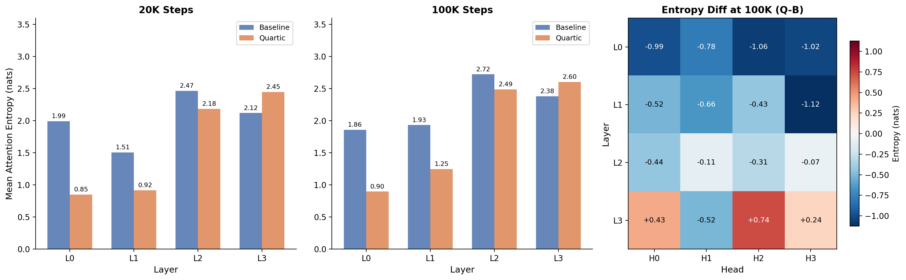
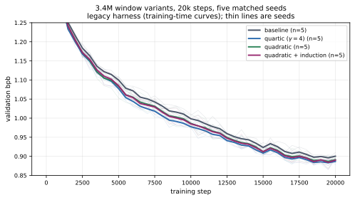
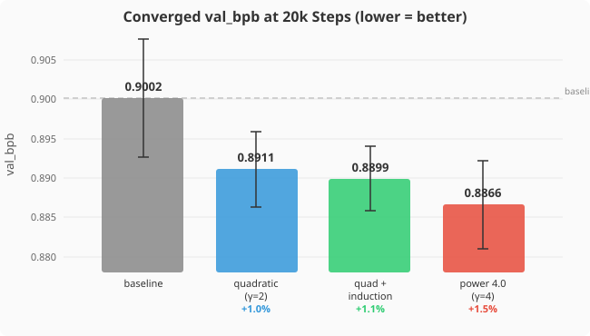
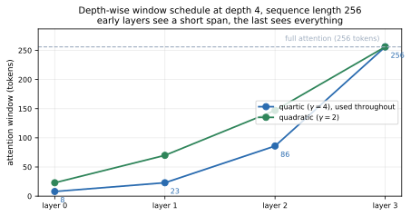
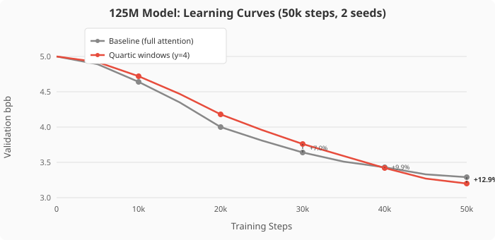
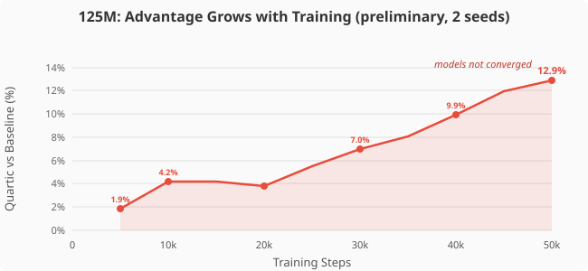
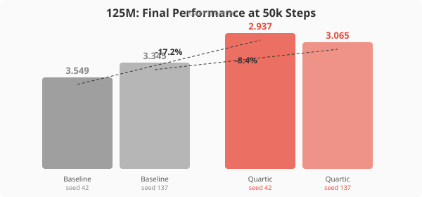
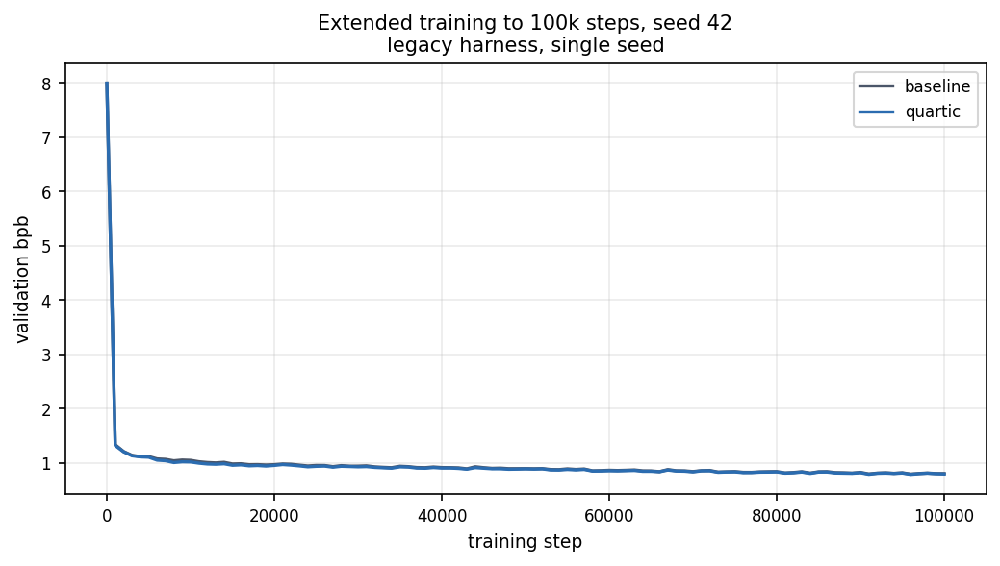

# NeuroGen

**Early-layer attention locality is a training curriculum, not an architectural requirement.**

An [autoresearch](https://github.com/karpathy/autoresearch) project. Restricting early transformer layers to a local attention window and letting later layers attend globally is well-established prior art — **this repo does not claim it**. What it tests is *when* the constraint is needed. Answer: only early. Train a 3.4M transformer with quartic attention windows for the first 10K of 20K steps, then switch to ordinary full attention, and the benefit survives. The locality prior belongs in the training recipe, not in the deployed architecture.

## What's known vs. what's new

**Known (not our claim).** Lower layers want a restricted attention range and upper layers need global context. Models *learn* this profile when span is made trainable ([Sukhbaatar et al., ACL 2019](https://arxiv.org/abs/1905.07799)); ablations confirm it ([Rae & Razavi 2020](https://arxiv.org/abs/2007.03356)); MSWA imposes it as a shallow→deep window ramp and reports quality *and* efficiency gains ([Xu et al. 2025](https://arxiv.org/abs/2501.01039)); Mistral and Gemma ship local-global hybrids in production ([Jiang et al. 2023](https://arxiv.org/abs/2310.06825), [Gemma 3](https://arxiv.org/abs/2503.19786)). Experiment 8 below reproduces this and adds nothing to it.

In all of that work the locality is a property **of the model** — present at init, during training, and at inference.

**New (our claim).** It is a property of the **training trajectory**. Remove the windows halfway through training and the benefit stays. Nothing above tests that; the closest neighbors go the other direction (SWAT trains *with* windows to keep them at inference; Shortformer is a curriculum over sequence length, not over per-layer span).

## Key Finding — the windows can be removed

Three arms, 20K steps each, same seed → same init *and* same data order. Only the attention mask differs.
Arm **A** full attention throughout · arm **B** quartic windows throughout · arm **F** quartic for 10K steps then full attention for 10K.

```
seed   A: full   B: quartic  F: quartic→full   B vs A   F vs A   F vs B
42     0.9041    0.8927      0.8952            +1.26%   +0.98%   -0.28%
137    0.8913    0.8788      0.8746            +1.40%   +1.87%   +0.48%
256    0.8941    0.8830      0.8865            +1.24%   +0.85%   -0.39%
789    0.9098    0.8896      0.8887            +2.23%   +2.32%   +0.10%
1337   0.9016    0.8889      0.8901            +1.41%   +1.28%   -0.14%

mean   0.9002    0.8866      0.8870            +1.51%   +1.46%   -0.05%   (n=5)

F vs A:  5/5 positive, perm 1/32 = 0.031, paired_t 0.0064, dz 2.34   → CLAIMED
F vs B:  2/5 positive, perm 0.625,        paired_t 0.771,  dz -0.14  → not claimed
```

**What this supports:** F beats A on **all five** seeds. The exact sign-flip permutation test hits its floor (p = 0.031), paired-t p = 0.0064, dz = 2.34. The benefit of the locality constraint *survives its removal* — the windows are not doing ongoing work in the second half of training. Both criteria were fixed before the runs.

**What this does NOT support:** that removal is *better* than keeping the windows. Only 2/5 seeds favour it, the mean is −0.05%, and dz ≈ 0. This isn't a near miss — the difference is an order of magnitude below the 0.0023 bpb residual noise on this comparison. **More seeds won't fix it; a lower-variance endpoint measurement would** (see [pre-registered experiment 4](#pre-registered-experiments)). An earlier draft, working from the 2 seeds that completed in an earlier 3-seed run, read F's `+1.50%` against B's `+1.33%` as evidence that windows eventually become a ceiling. Those two seeds disagreed in sign; the reading did not survive replication.

Reproduce: `uv run python analyze_exp7.py`

**The switch is a shock, and the divergence is stochastic.** An earlier 3-seed run lost arm F at seed 256 to NaN. It is tempting to read that as a property of seed 256; it isn't. In the 5-seed replication above that *same* seed completed normally at 0.8865, and **no seed diverged**. Observed rate across both runs: **1 divergence in 8 completed arm-F runs**, tied to no seed.

What every run takes is a large transient shock. Per-step instrumentation around step 10000, across all five seeds:

```
                       pre-switch   at switch    peak (first 100)   by step 10400
loss                   0.68         2.21-2.37    —                  0.67
grad norm (pre-clip)   0.136        2.13-2.72    —                  0.136
max Adam update        3.5e-3       3.6e-3       7.5-7.6e-3         3.3e-3
```

The peak Adam update is **2.13–2.16× pre-switch on every one of the five seeds** — a 1.4% spread. That consistency is what makes it a usable diagnostic, where the divergence itself (1 in 8) is not.

**Which part of the switch causes which part of the shock.** Five treatments, all resumed from one identical pre-switch state (seed 256), so they differ only in the intervention:

```
treatment              peak loss   peak gnorm   peak Adam upd   recovery
unmodified switch      2.2112      2.193        7.54e-3         28 steps
masked-softmax control 2.2112      2.193        7.54e-3         28 steps
optimizer reset        2.2112      2.193        1.56e-3         68 steps
200-step LR re-warmup  2.2424      2.193        1.90e-3         72 steps
500-step window ramp   0.7490      0.181        6.71e-3          1 step
(pre-switch reference) 0.68        0.136        3.53e-3          —
```

- **(i) kernel change — eliminated.** The masked-softmax control agrees with the unmodified switch to 1e-6 (the log's rounding precision) at all 501 traced steps. *Caveat:* MPS `scaled_dot_product_attention` appears to dispatch to the same arithmetic as the explicit path, so this may not transfer to a genuinely fused CUDA kernel.
- **(ii) stale Adam second moment — confirmed as the amplifier.** Optimizer reset leaves loss and gradient spikes untouched but cuts the peak update 4.8×, below its pre-switch value (a fresh Adam has `m̂/√v̂ ≈ ±1` on step 1, bounding the update near the LR itself).
- **(iii) softmax denominator jump — confirmed as the source.** Ramping the windows over 500 steps widens the denominator gradually and **removes the shock rather than absorbing it**: loss spike 3.3× → 1.1×, gradient spike 12× smaller and *below the 1.0 clip threshold*, so no clipping fires at all.

The two absorbing interventions trade update magnitude for time — both cut the peak update ~4× but leave the model shocked ~2.5× longer (28 → ~70 steps). The ramp pays neither cost and reaches the same loss (0.6626 vs 0.6627 at step 10500).

**Mechanism result, not a validated recipe:** single seed, stopped 1000 steps after the switch. It establishes what causes the shock, not that any treatment improves converged val_bpb or lowers the 1-in-8 divergence rate — catching that would need many runs. But on present evidence the recipe is **ramp, don't switch**.

(The LR schedule was ruled out by inspection before any of this — a single cosine over the full 20K horizon with no term keyed to the switch step.)

Reproduce the sweep: `uv run python experiment_mechanism.py --exp7 --seed-list 42,137,256,789,1337` (~7 h; data in `gradient_results/exp7_curriculum_sw10000_5seed.json`).

## What the curriculum leaves behind

If removing the windows preserves the benefit, something they created must persist without them. Two measurements.

### 1. Attention entropy stays low at 5× longer training



```
         --- 20K Steps ---              --- 100K Steps ---
Layer    Baseline  Quartic  Change      Baseline  Quartic  Change
L0       1.994     0.852    −57.3%      1.860     0.898    −51.7%  ← stays focused
L1       1.506     0.916    −39.2%      1.933     1.248    −35.4%
L2       2.466     2.183    −11.5%      2.722     2.489    −8.6%
L3       2.120     2.449    +15.5%      2.382     2.605    +9.4%   ← stays diffuse
```

Early layers keep ~44% lower entropy even at 100K steps. The specialization is a property of the **weights**, not of the mask — which is exactly what the removal result predicts. Attention spans at 100K confirm it is learned locality, not just a mask: quartic layer 0 uses ~2 of its 8 allowed tokens; baseline layer 0 uses ~8 of 256.

```
Baseline 100K:  [8/256, 12/256, 22/256, 15/256]   (all layers diffuse)
Quartic 100K:   [2/8,   3/23,  11/86,  29/256]    (early layers tightly local)
```

### 2. Gradient covariance rank collapses under the constraint

Effective rank of the layer-0 Q/K gradient covariance, 50 samples per window size, frozen baseline checkpoint:

```
window   eff_rank   var in top-1 component
8         17.2       96.7%
32        45.5       34.0%
64        48.4        9.2%
128       48.6        5.9%
256       48.6        6.1%
```

Full attention → window 8 drops effective rank **48.6 → 17.2** (2.8×), with 96.7% of gradient variance in a single component vs 6.1%. Under the constraint each step updates a coherent low-dimensional subspace instead of a diffuse high-dimensional one. A plausible route by which an early constraint fixes a hierarchy that then persists — though the causal link is not directly shown.

Complementary: gradient **noise** norm is flat across window sizes (0.0052–0.0058) while **signal** norm rises 18× from window 256 (0.0017) to window 8 (0.0323). Windows increase coherence; they don't remove noise.

## Where the effect lives: early layers

Replacing the quartic schedule with explicit per-layer window lists, all at seed 42 (same init *and* data order, so only the window differs):

```
config      windows [L0,L1,L2,L3]   final    vs baseline   % of quartic gain
baseline    [256,256,256,256]       0.9041   —             —
only_L0     [  8,256,256,256]       0.8952   +0.98%         78%
only_L01    [  8, 23,256,256]       0.8880   +1.79%        141%   ← beats quartic
quartic     [  8, 23, 86,256]       0.8927   +1.26%        100%   (reference)
no_L0       [256, 23, 86,256]       0.8979   +0.69%         54%
only_last   [256,256,256,  8]       0.9127   −0.95%        −75%   ← worse than baseline
```

Windowing layer 0 alone recovers 78% of the gain; windowing the first two layers **exceeds** quartic; the reversed control (only the last layer local) is **worse than baseline**. So it's specifically *early* locality — and the gradual ramp is not essential.

This **confirms and localizes a known result** ([Rae & Razavi 2020](https://arxiv.org/abs/2007.03356), [Sukhbaatar et al. 2019](https://arxiv.org/abs/1905.07799), [MSWA](https://arxiv.org/abs/2501.01039)); it is not a new one. Caveat: n=1 seed. The big effects are robust to the noise floor; the small `only_L01` > `quartic` margin (0.0047 bpb) needs replication. Reproduce: `uv run python analyze_ablation.py`.

## Supporting result: the windowed schedule itself (3.4M, 5 seeds)

**Statistical validation (20K steps, 5 matched seeds, paired test):**

```
config                  mean bpb   std      vs baseline   perm_p(1-sided)   paired_t   dz
baseline                0.9002     0.0075   —             —                 —          —
window_power_4.0        0.8866     0.0056   +1.5%         1/32 = 0.031      0.0013     3.59
window_quadratic        0.8911     0.0048   +1.0%         1/32 = 0.031      0.0122     1.94
window_quad_induction   0.8899     0.0041   +1.1%         1/32 = 0.031      0.0094     2.09
```

All 5 seeds of every window variant beat their own paired baseline, so the exact sign-flip permutation test hits its floor of 1/32 for every variant. Throughput identical: 4.8 steps/sec on M1 Pro.

Because the runs are *paired* (each seed trains baseline and variant from the same init), the right test is a paired one. The paired residual sd (~0.004 bpb) is ~14× below the MPS run-to-run noise floor (~0.055 bpb) — which is *why* an effect this small is detectable at all. (An earlier draft reported p=0.001 from an unpaired Welch test with a normal approximation; that is the wrong test for paired data and overstates significance.)

`window_quad_induction` (quadratic windows + pre-wired induction heads) reaches only **+1.1%** — adding the scaffold does not help beyond the constraint itself. There is no configuration in this repo that reaches the "+5.2% combined with induction circuits" figure from an earlier paper draft; that number was removed.

Reproduce: `uv run python analyze_all.py` (3.4M section).







## Scale probe: 125M on H100

**Per-seed gap at a matched 20K steps, all 5 seeds.** Each seed's baseline and quartic arms share an LR schedule, so the within-seed gap is valid even though seeds 42/137 run a 50K schedule (read at step 20K) and 256/789/1337 are dedicated 20K runs:

```
seed   baseline   quartic    gap
42     4.101      3.894      +5.04%
137    4.090      3.989      +2.47%
256    3.696      3.704      -0.21%   ← quartic WORSE on this seed
789    3.578      3.503      +2.09%
1337   3.620      3.492      +3.53%

mean   +2.6% (sd 1.94), 4/5 seeds positive
paired: perm_p = 2/32 = 0.063,  paired_t p = 0.045,  dz = 1.29
```

**The 125M headline is +2.6% at 20K across 5 seeds with one seed negative.** This is weaker than the 3.4M result (5/5 positive, permutation at its floor) and is a suggestive scale probe, not a demonstrated scaling law.

Windowed 125M runs are slightly faster than baseline (2.83–2.84 vs 2.73–2.78 steps/sec) — Flash Attention's sliding window computes fewer scores. Under the curriculum recipe that advantage applies only to the windowed phase; inference runs at standard full-attention cost.

Reproduce: `uv run python analyze_125m.py`.





<details>
<summary><b>Appendix: the 50K extension (unconverged — does not support a scaling claim)</b></summary>

Two of the five seeds were extended to 50K steps. The gap there is much larger, but **neither arm is converged**, so it is uninformative about the asymptotic gap:

```
seed   baseline   quartic    gap
42     3.549      2.937      +17.2%
137    3.345      3.065      +8.4%
mean   3.447      3.001      +12.9%   ← n=2, UNCONVERGED — do not cite
```

Decline over the final 10K steps, in bpb per 1k steps — the convergence gate is <0.002:

```
baseline s42   0.0098      quartic s42   0.0208
baseline s137  0.0084      quartic s137  0.0166
```

All four are an order of magnitude above the gate, and the **quartic arms are descending faster than the baselines**. A widening gap between two curves that are both still falling is exactly what an unconverged head start looks like. Settling this needs a fresh three-arm run under a single fully-annealed horizon — specced below.


</details>

## Mechanism: what was ruled out

Seven experiments tested why the constraint helps.

| Hypothesis | Evidence | Verdict |
|---|---|---|
| Gradient noise removal (Exp 1) | Noise norm flat at 0.0052–0.0058 across windows 8–256; only signal changes (18×) | Eliminated |
| Softmax coupling contamination (Exp 2) | Noise fraction 4.0–6.9% across all 4 layers | Eliminated |
| Variance reduction (Exp 3) | Larger batch can't replicate at equal tokens | Eliminated (n=1) |
| Landscape smoothness (Exp 6) | Quartic-trained models have *lower* gradient stability on **both** seeds (0.0335 vs 0.0358 at s42; 0.1101 vs 0.1121 at s137) | Eliminated |
| Ongoing structural constraint (Exp 7) | Removing windows preserves the benefit | Eliminated |
| **Implicit regularization (Exp 4)** | s42: quartic gap *larger* (+2.48% vs +0.32%). s137: quartic gap *smaller* (−2.70% vs +0.80%). Seeds contradict | **Inconclusive at n=2** |

**Experiment 3 — variance reduction control (seed 42 only).** If windows worked by reducing gradient variance, larger batches should replicate them. At 2000 optimizer steps:

```
config                eff batch   bpb      tokens     note
baseline (full attn)       32     1.242     16.4M     —
quartic windows            32     1.224     16.4M     +1.45% vs baseline
full attn, batch 128      128     1.086     65.5M     4× the data

Token-matched at 16M tokens seen:
  quartic windows      1.224  ← best
  baseline             1.242
  batch 128 (step 500) 1.357  ← worse than baseline
```

Larger batches look better only because they saw 4× more data. At equal token budget windows win and larger batch loses. **This is a single seed (42), not 3** — an earlier draft said 3 seeds. A batch-256 arm was launched but timed out at step 1000 and is excluded; the `1.033 @ 131M tokens` and `~1.45` figures from earlier drafts had no completed run behind them and are removed.

*(A direct Hessian probe of landscape flatness was also attempted but was inconclusive at n=1 — the attention-entropy↔sharpness relationship is already well-studied, so a credible test needs multiple converged pairs at scale; left to future work.)*

## Pre-registered experiments

Criteria stated in advance so outcomes can't be re-framed after the fact. **None of these have been run.**

**1. Removal at 5 seeds — ✅ DONE**, results in [Key Finding](#key-finding--the-windows-can-be-removed) above.
*Criteria, fixed before the runs:* claim "removal preserves the benefit" iff **5/5** paired diffs (A − F) positive → permutation floor p = 0.031. Claim "removal is better than keeping" only if **≥4/5** paired diffs (B − F) positive **and** paired-t p < 0.05; at 2/5 or 3/5, report no detectable difference. Diverged seeds count in the denominator.
*Outcome:* first criterion **met** (5/5, p = 0.031, paired-t 0.0064, dz 2.34); second **failed** (2/5, p = 0.625). No seed diverged.

**2. Shock diagnosis — ✅ DONE**, results in [the shock section](#key-finding--the-windows-can-be-removed) above.
*Criterion, fixed before the runs:* five treatments from one shared pre-switch state; report which reduces the peak Adam update toward its pre-switch 3.5e-3. Optimizer reset predicted to — **and if it didn't, the stale-second-moment account gets withdrawn.**
*Outcome:* reset cut the peak update 4.8×, so the account stands. Kernel change eliminated. The window ramp, included only as a candidate mitigation, turned out to remove the shock at its source. Still untested: whether any treatment improves converged val_bpb or lowers the 1-in-8 divergence rate.

**3. Switch-point sweep** — remove windows at 2K/5K/10K/15K of a 20K run, 5 seeds (~19–21 h). This is what turns "windows are a curriculum" into a recipe, and it's currently missing entirely.
*Criterion:* claim an optimal removal point only if the best interior x beats **both** endpoints (x=0 is arm A, x=20K is arm B) on ≥4/5 paired seeds. If flat, the finding is "the removal point doesn't matter over 10–75% of training" — a stronger recipe, since it needs no tuning. Report divergence rate per switch point.

**4. Fixed evaluation set** — *prerequisite for resolving #1's secondary claim.*

The reported `final_bpb` of every run in this repo is a single eval over **12 randomly drawn batches = 98,304 tokens, 0.51% of the val set**, resampled on every call. Measured directly, by evaluating one *frozen* checkpoint 12 times:

```
baseline_s42   sd 0.0083   range 0.0304
quartic_s42    sd 0.0063   range 0.0219
effect being measured                0.0136
```

Endpoint noise is over half the effect. The paired design rescues it, because paired arms consume the RNG near-identically and therefore draw nearly the same eval batches, so the noise is common-mode and cancels:

```
comparison                                r(eval wiggles)   residual sd of difference
A vs B   (both validate.py)                   +0.989              0.0010
A vs Q   (both validate.py)                   +0.992              0.0012
A vs F   (F from experiment_mechanism.py)     +0.947              0.0023
```

Arm F sits on a slightly different RNG stream — `validate.py` calls `measure_attention_spans` every 5000 steps and draws batches; `experiment_mechanism.py` does not — so F comparisons carry **2.3× more residual noise** than A-vs-B ones. Against that residual: `F vs A` is 3.9σ and 7.6σ (solid), `A vs B` is 11–20σ (rock solid), but `F vs B` is 0.8σ and 2.1σ — indistinguishable from noise.

*Change:* add `fixed_eval_batches(val_data, ..., seed=0)` to `prepare.py`, returning deterministic start offsets built once from a **private** `torch.Generator` so it draws nothing from the global stream (drawing from the global stream would perturb training data order and change the runs themselves). `evaluate_val_bpb(..., fixed=True)` iterates those offsets. Size 1,048,576 tokens (128 batches, 10.7× current, 5.5% of val); estimated eval overhead ~8% of wall clock. Every arm uses it.

*This is a clean break.* Training is unaffected, but the recorded endpoint changes for every existing run, so per this repo's matched-null rule **do not compare new-harness numbers to old-harness ones** — all arms must be re-measured together. Re-evaluating saved checkpoints is far cheaper than retraining, so what limits the cost is which checkpoints exist:

```
arm            checkpoints available                        cost to re-measure
F (switch)     seeds 137/256/789/1337 (saved by exp7)       re-evaluate (minutes)
F, seed 42     none — but its pre-switch state is saved     ~55 min from the switch
A, B           seeds 42/137 both; 256 baseline only         retrain the other 7 arms
```

`experiment7` now saves its final F model with the **post-switch** `arch_cfg` recorded, because an F model is full-attention at the end — reloading it under the quartic config would silently evaluate the wrong operator. `validate.py` already saves A and B, but 5 of those 10 checkpoints predate current practice and are missing, so a full re-measurement is ~19–22 h MPS today and falls to roughly the A/B retrain alone once F checkpoints exist.

*Criteria:* re-evaluating one frozen checkpoint 12× must give **sd exactly 0.0** (bit-identical), not merely small — that is the whole point. Report the new baseline mean (expect within ~0.01 bpb of the old; sanity check, not a claim) and the new paired residual sd for A-B and A-F (expect A-F to fall from 0.0023 toward the A-B value).

*What it unlocks, and what it says about #1:* with residual sd 0.0023 and the observed F-vs-B effect (~0.0015), n=5 gives P(5/5 positive) ≈ 22% and expected paired-t p ≈ 0.22 — so **experiment #1 is unlikely to resolve F vs B**, and that is expected, not a failure. Reaching p<0.05 at n=5 needs the residual below ~0.0012, which removing the eval component plausibly achieves. `F vs A` and `A vs B` are already far outside the noise and do not depend on this.

**5. Converged 125M, three arms, one horizon** — baseline / windows-throughout / windows-removed-at-25K, 50K steps (6.55B tokens ≈ 53 tok/param), single fully-annealed cosine, no resume, 3–5 seeds. **≈45 H100-hours at 3 seeds, ≈75 at 5.**
*Criterion:* a run counts as converged only if its decline over the final 10K steps is <0.002 bpb/1k; report the measured value for every run. Note n=3 floors the permutation test at 0.125 and cannot reach p<0.05, so a 3-seed result is descriptive. **Pre-registered negative:** if the converged gap is smaller than the 20K gap, we report that the 50K figures were an undertraining artifact.

## How It Works

A standard transformer uses full attention at every layer. The window schedule restricts each layer's attention based on depth, forcing early layers to build local features before later layers integrate globally:

```python
def compute_window(layer_idx, n_layers, seq_len, exponent=4.0):
    progress = (layer_idx + 1) / n_layers
    return int(base + progress ** exponent * (seq_len - base))
```

```
Layer windows at depth 4:  [8, 23, 86, 256]       (3.4M model, base 8)
Layer windows at depth 12: [16, 16, 16, ..., 1024] (125M model, base 16)
```

Found through systematic search across power functions (exponents 0.5–12.0), sigmoid curves, logarithmic, exponential, and Fibonacci schedules. The optimal exponent is 3–4 at depth 4. `windows.py` is the single source of truth, shared by both scales.

## Generation Samples (100K steps)

240 stories per model (12 prompts × 20 seeds) from the 100K-step checkpoints. Both models are 3.4M params on TinyStories — at this scale, qualitative differences are modest.

```
metric                Baseline     Quartic     note
mean words/sample       31.2        30.3
vocab diversity         0.789       0.801       +1.5% (quartic more varied)
3-gram repetition       0.011       0.015       (both very low)
```

The most visible difference is in failure modes. When baseline fails it tends toward **repetitive phrase loops**; quartic's failures are more varied.

> **Prompt: "The dog found a big red"**
>
> **Baseline:** ball. The dog was happy to play with the ball. **The dog wagged his tail** and licked the dog's ears. **The dog wagged its tail** and barked happily. **The dog wagged its tail** and barked happily. The dog ran to catch the dog...
>
> **Quartic:** ball of yarn in his mouth. He bit it and made a loud noise. The blue ball rolled into the ball. The ball was sad.

> **Prompt: "Tom was very sad because"**
>
> **Baseline:** he could not play on the swings and the slide. *(stops — 10 words)*
>
> **Quartic:** he really wanted to go to the market. His mom was very kind and said that Tom needed help. *(continues into full narrative — 19 words)*

These are cherry-picked contrasting pairs. On most seeds both models produce similar-quality output. The real evidence is the bpb improvement and the entropy analysis, not generation quality at 3.4M scale.

Full 240-sample comparison: [`samples/all_20_samples.txt`](samples/all_20_samples.txt) | Best-of-5 ranked pairs: [`samples/best_of_5_comparison.txt`](samples/best_of_5_comparison.txt)

## Extended training (100K steps, seed 42)



```
step     baseline   quartic    gap        note
1k       1.3394     1.3261     +0.99%
5k       1.1216     1.1086     +1.16%
10k      1.0512     1.0210     +2.87%     ← peak gap
20k      0.9709     0.9572     +1.41%
50k      0.8983     0.8933     +0.56%
100k     0.8072     0.7994     +0.97%

Best seen: quartic 0.7921 (96k) vs baseline 0.7980 (96k)
```

The gap peaks early, narrows, and does not close by 100K. This is a **single seed**, and the MPS noise floor (~0.055 bpb) exceeds the final gap — so the endpoint value is not a measured effect size (the paired 5-seed table above carries that). What this run supports is the qualitative shape: an early peak consistent with a curriculum effect, and no reversion at long horizons.

## Research Journey

This project ran 200+ autonomous experiments across 5 phases. The window schedule was not designed — it was the surviving candidate.

- **Round 1** (50 experiments): CA weight initialization gives ~0.8% improvement. Live CA fails on MPS due to overhead.
- **Round 2** (40 experiments): CA init advantage holds at 30min training (constant offset, not head start).
- **Round 4** (68 experiments): 26 architecture variants including CA modulation channels, embryogenic CA, universal circuit pre-wiring, token vitality, sleep consolidation. Most failed. Attention window growth emerged as the clear winner.
- **Validation** (20 experiments): confirmed at 20K steps with 5 seeds, paired. Throughput-neutral.
- **125M scaling** (15 experiments): +2.6% across 5 seeds at 20K (1 negative).
- **Mechanism** (7 experiments + per-layer ablation): eliminates five hypotheses (implicit regularization inconclusive at n=2), and identifies the removal result as the load-bearing finding.

### What Didn't Work
- CA modulation channels (model collapse)
- Token vitality / cell death dynamics (model collapse)
- Sleep consolidation (overhead outweighed benefit)
- Pre-wiring known circuits alone (induction heads, layer roles — gradient descent prefers organic discovery)
- Live CA during training (any per-step overhead hurts at small scale)
- Embryogenic activity-dependent CA (marginal gains, high overhead)

### What Did Work
- **Attention windows as a training curriculum** (quartic growth, +1.5% at 3.4M with 5/5 seeds; benefit survives removal at 10K)
- **Block-diagonal CA init** (+0.6% at 10min, constant offset)

## Follow-up: Trajectory Analysis & Topographic Regularization

A separate investigation on the `autoresearch/trajectory-topography` branch examined what token embeddings actually do during training — how they evolve across checkpoints rather than just their final state — and asked whether imposing topographic organization on them would improve learning. Full writeup in [`reports/writeup/draft.md`](reports/writeup/draft.md) on that branch. Three findings:

### 1. Phase-structured representation formation

Using 111 checkpoint snapshots over the 100K-step baseline training run, at least two byte classes go through a two-stage formation dynamic. The digit class `0`-`9` forms a coarse category first (within-class cosine rises to +0.49 by step 47K), then **partially decomposes along an ordinal axis** in a second phase: numerically-adjacent digits remain close while distant digits move apart. The correlation `r(pairwise cos, |i−j|)` strengthens from +0.28 at init to −0.39 at step 70K, with the steepest emergence happening *after* the coherence peak. Endpoint analysis cannot distinguish "the category is degrading" from "the category is refining along an informative axis"; the trajectory shows that the latter is what's happening.

Corpus check correction: the ordinal axis is **context adjacency** (digits in similar age-template positions like "3 years old", "4 years old"), not arithmetic composition — TinyStories contains zero arithmetic syntax in a 200M-byte sample. The phase-structure finding stands; the mechanism label was narrowed after a substrate check.

A related finding: the sentence-punctuation triad `.`, `!`, `?` converges to its mutual cluster via an **anchor-driven sequential dynamic**. `.` reaches its final region at step 3000; `!` at 12000; `?` at 16000 — 5.3× sequential separation. The anchor is the most-frequent member (`.` is ~30× more frequent than `?`). Verification on additional triads shows this pattern is **asymmetry-gated**: in triads with ≥10× frequency asymmetry (`.!?` and `,;:`), the anchor pattern holds; in symmetric triads (digit triples with <4× asymmetry), convergence is simultaneous. Not universal — a specific, falsifiable condition on when the dynamic emerges.

### 2. Gaussian-kernel topographic losses have a structural pathology

Four pilot experiments attempted to impose topographic organization on token embeddings via a regularization loss that would pull co-occurring bytes to be grid-adjacent on a learnable 16×16 grid. Three formulations, three distinct failure modes:

- **Gaussian pure attractive**: collapse to coincidence (topographic loss saturates at floor, positions freeze).
- **MSE against similarity targets, zero target for non-cooccur pairs**: escape to large separations (positions expand past 1.5× initial spread, kernel gradient vanishes, system freezes).
- **Equilibrium MSE with non-zero floor target**: bimodal failure — high-cooccur pairs collapse past the equilibrium to coincidence, low-cooccur pairs escape past the equilibrium to extremes.

Unified diagnosis: **any loss that factors through a Gaussian kernel `K(d) = exp(−d² / 2σ²)` has gradient magnitude that vanishes in both the `d → 0` and `d → ∞` limits**, so stable equilibria of such losses are stationary points but not attractors. Target-matrix engineering cannot extend force into the vanishing-gradient tails. The pathology is structural, not calibration-dependent. Future work on gradient-based topographic regularization of transformer embeddings should use distance-based losses (`L = mean((d_ij − target_d_ij)²)`) rather than kernel-based ones, which have globally well-behaved gradient dynamics.

### 3. Quartic produces emergent topographic-like correlation, but it's not functionally useful

If topographic organization can't be imposed via a loss, does it emerge as a side effect of the **architectural** constraint that the main NeuroGen program validated? A second 100K-step run trained with `window_power_4.0` at identical schedule and seed. Result:

| measure | baseline | quartic | Δ |
|---|---:|---:|---:|
| Spearman ρ(cooccur, cos) on non-zero pairs | +0.054 | **+0.161** | +0.107 (~3× stronger) |
| final val_bpb | 0.7943 | 0.7915 | −0.003 (within MPS variance) |

Quartic embeddings correlate with co-occurrence ~3× more strongly than baseline's — **emergent topographic-like organization**, produced by the architecture alone without any explicit loss.

A functional test followed: if this organization is useful for prediction, quartic should do better on val positions where co-occurrence signal is strong. For each position, bigram entropy `H(next | prev)` quantifies how informative the preceding byte is. Low `H` = tightly constrained (e.g., `q` → `u`); high `H` = ambiguous. Bucket val positions by `H` and compare per-bucket NLL across 1.6M tokens:

| bucket | H (bits) | n | baseline NLL | quartic NLL | Δ bpb |
|---|---|---|---|---|---|
| 0 (most constrained) | 3.51–4.22 | 323K | 0.324 | 0.323 | −0.001 |
| 1 | 4.22–4.28 | 331K | 0.313 | 0.313 | +0.000 |
| 2 | 4.28–4.34 | 287K | 0.315 | 0.316 | +0.001 |
| 3 | 4.34–4.55 | 327K | 0.237 | 0.237 | +0.000 |
| 4 (least constrained) | 4.55–5.05 | 370K | 1.448 | 1.448 | −0.001 |

**No bucket-dependent advantage.** All deltas below 0.001 bpb (the within-run noise floor). Per-byte analysis shows tiny effects at the margins (quartic advantaged on uppercase-letter contexts, disadvantaged on quote/newline contexts), all smaller than 0.06 bpb. In aggregate, and in the test designed specifically to detect co-occurrence-driven advantage, the two models are **functionally indistinguishable** for next-token prediction.

**Structural correlation is not functional utilization.** Quartic's topographic-like organization is real but ornamental. Both models encode co-occurrence information; quartic does so in static embedding geometry while baseline does so in attention patterns and context-dependent computation. Either strategy solves the LM task equally well. This double-reframes the topographic regularization program: not only are the Gaussian-kernel loss formulations pathological (§2 of the writeup), but even when topographic organization is produced as a free side effect (via architectural constraint), the model doesn't exploit it for prediction. The original hypothesis — that topographic organization would improve learning on this task at this scale — is not supported.

The quartic val_bpb improvement reported above appears to come from the curriculum mechanism documented in the "Mechanism" section, **not** from the emergent topographic-like organization. Two distinct effects produced by the same architecture: one functionally useful, one functionally ornamental.

### Methodological contributions

Three principles named explicitly in the writeup that generalize past this project:

- **Positions, not displacements**, for trajectory-geometry analyses. Displacement vectors mix structured final state with isotropic initialization; variance is dominated by the random part and masks structure. Work on `w_t` at each checkpoint; use displacements only with initialization-matched null baselines.
- **Matched-null baselines** when a new experiment changes parameter allocation or optimizer setup. MPS non-determinism on this hardware produces ~0.055 val_bpb variance across otherwise-identical runs — larger than several effects the experiment was meant to detect.
- **Substrate-check before interpretation.** When a finding feels clean enough to commit to, run one more check on the substrate it assumes. Caught two near-overclaims in this work (the flat-spectrum resolution, the digit-arithmetic → context-adjacency correction).

## Quick Start

### 3.4M model (Apple Silicon / CPU)

```bash
# Install
curl -LsSf https://astral.sh/uv/install.sh | sh
uv sync

# Download data (TinyStories, ~50MB)
uv run prepare.py

# Train baseline
uv run train_r4.py --arch baseline --minutes 40 --seed 42

# Train with quartic windows
uv run train_r4.py --arch window_power_4.0 --minutes 40 --seed 42

# Step-budget validation (eliminates throughput confounds)
uv run validate.py --arch window_power_4.0 --steps 20000 --seed 42
```

### 125M model (CUDA / H100)

```bash
# flash-attn is optional — train_125m.py falls back to PyTorch SDPA without it.
pip install torch numpy datasets tiktoken
pip install flash-attn   # optional, CUDA only (no macOS wheels)
# or, with uv:  uv sync --extra scale-125m

# Download data (FineWeb-Edu, ~100M tokens)
python train_125m.py --prepare

# Throughput audit (verify equal speed across configs)
python train_125m.py --throughput

# Train single run
python train_125m.py --arch window_power_4.0 --steps 50000 --seed 42

# Curriculum run: windows for the first 25k steps, then full attention
python train_125m.py --arch window_power_4.0 --switch-step 25000 --steps 50000 --seed 42

# Generate text from checkpoint
python train_125m.py --generate checkpoints_125m/window_power_4.0_s42.pt
```

### Mechanism experiments (Apple Silicon / CPU)

```bash
# Exp 1-3: gradient analysis (~2.5 hours)
uv run experiment_gradient.py --all

# Exp 4-6: disambiguation (~45 min)
uv run experiment_mechanism.py --exp4 --exp5 --exp6

# Exp 7: the removal test (~1.3 h per seed)
uv run experiment_mechanism.py --exp7 --seed-list 42,137,256,789,1337 --switch-step 10000

# Switch-point sweep
uv run experiment_mechanism.py --exp7 --seed-list 42,137,256 --switch-step 5000

# Per-layer ablation across seeds
uv run analyze_ablation.py --seeds 42,137,256,789,1337

# Cross-scale analysis with figures
uv run analyze_all.py
```

## Project Structure

```
# Training
prepare.py              — data prep + tokenizer (3.4M, TinyStories) — frozen eval harness
train_r4.py             — 3.4M model with 24 architecture variants
validate.py             — step-budget convergence runs with diagnostics
train_125m.py           — 125M model (GPT-2 small) for H100
windows.py              — shared attention-window schedule (used by 3.4M + 125M)
ca_rules.py             — CA rule library
tests/                  — CPU unit tests (window math, bpb, CA init); run: uv run --extra dev pytest

# Mechanism experiments
experiment_gradient.py  — experiments 1-3 (gradient quality, decomposition, variance)
experiment_mechanism.py — experiments 4-7 (regularization, coupling, landscape, removal)

# Analysis
analyze_125m.py              — 125M statistical analysis
analyze_all.py               — cross-scale analysis with figures
analyze_attention_entropy.py — per-layer attention entropy (20K)
analyze_entropy_100k.py      — entropy persistence analysis (20K vs 100K)
analyze_ablation.py          — per-layer window ablation, paired across seeds
evaluate_quality.py          — generation quality metrics
interact.py                  — interactive inference (type prompts, see both models)

# Data
validation_results/     — convergence data (100K + 20K × 5 seeds × configs)
results_125m/           — 125M results (20K × 5 seeds, 50K × 2 seeds)
gradient_results/       — mechanism experiment data (7 experiments + entropy)
samples/                — 480 generation samples (12 prompts × 20 seeds × 2 models)
charts/                 — figures for README and paper
papers/                 — paper (LaTeX + PDF)
```

## Hardware

- **3.4M model**: Apple Silicon (MPS), ~4.8 steps/sec on M1 Pro. Also works on CUDA and CPU.
- **125M model**: NVIDIA H100 80GB, ~2.8 steps/sec. Uses Flash Attention with native sliding window support.

## References

**Layer-wise attention range (the prior art this work builds on, and does not claim):**
- [Adaptive Attention Span in Transformers](https://arxiv.org/abs/1905.07799) — Sukhbaatar, Grave, Bojanowski & Joulin, ACL 2019. Models *learn* short spans in lower layers, long spans in upper layers.
- [Do Transformers Need Deep Long-Range Memory?](https://arxiv.org/abs/2007.03356) — Rae & Razavi, 2020. Lower layers benefit from a restricted attention range.
- [MSWA: Refining Local Attention with Multi-Scale Window Attention](https://arxiv.org/abs/2501.01039) — Xu, Nag, Li, Tian & Barsoum, 2025. Progressively increases window size shallow→deep.
- [Mistral 7B](https://arxiv.org/abs/2310.06825) — Jiang et al., 2023. Sliding window attention in production.
- [Gemma 3 Technical Report](https://arxiv.org/abs/2503.19786) — Gemma Team, Google DeepMind, 2025. High local:global layer ratio with short local span.

**Curriculum precedents on adjacent axes:**
- [Shortformer](https://arxiv.org/abs/2012.15832) — Press, Smith & Lewis, 2021. Sequence-length curriculum: train short first, then long. The closest curriculum precedent, on a different axis.
- [SWAT: Sliding Window Attention Training](https://arxiv.org/abs/2502.18845) — Fu et al., 2025. Trains *with* windows to keep them at inference — the opposite deployment story.
- [Short window attention enables long-term memorization](https://arxiv.org/abs/2509.24552) — Cabannes et al., 2025. Stochastically varying window size during training; hybrid retained.

**Other:**
- [nanochat](https://github.com/karpathy/nanochat) / [autoresearch](https://github.com/karpathy/autoresearch) — Karpathy. Training harness and experiment loop.
- [HyperNCA](https://arxiv.org/abs/2204.11674) — Najarro & Risi, 2022. NCA growing RL policy weights.
- [Growing Neural Cellular Automata](https://distill.pub/2020/growing-ca/) — Mordvintsev et al., 2020.
- Olsson et al., 2022 — In-context learning and induction heads.

## Paper

Preprint: https://doi.org/10.5281/zenodo.19642188

## License

MIT
