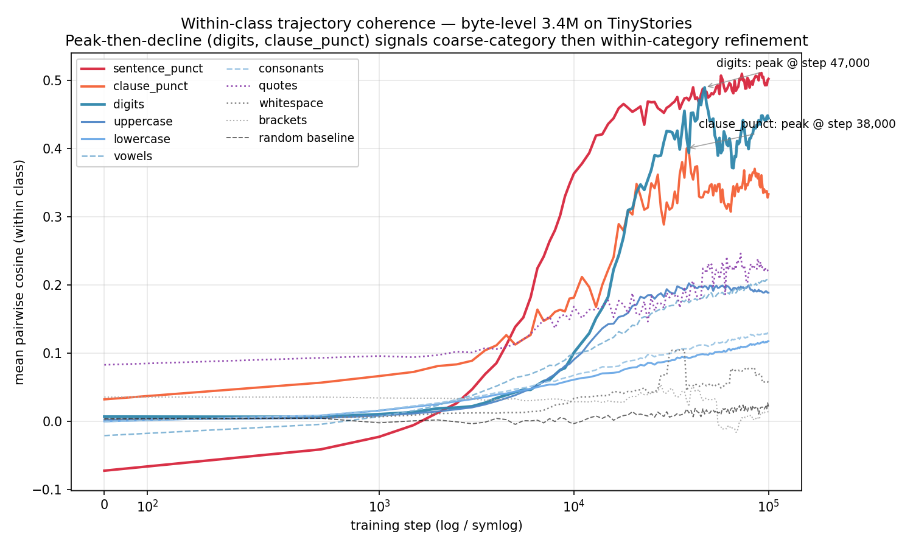
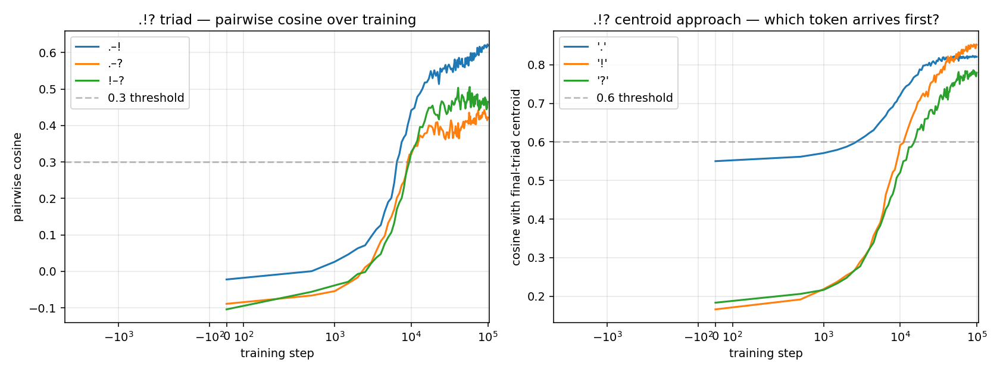
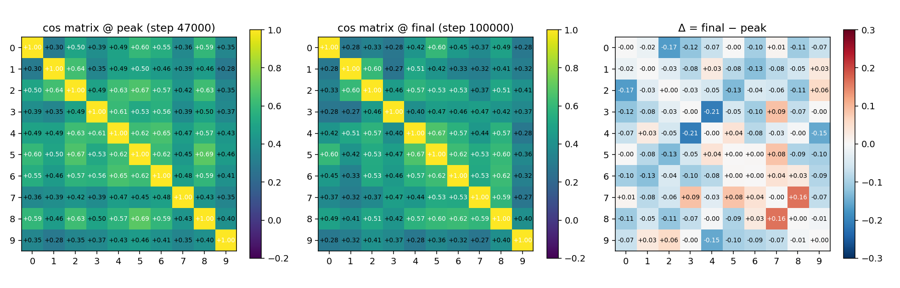
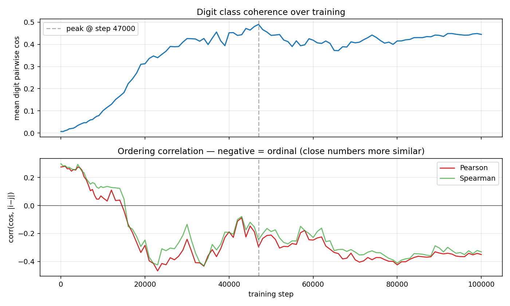
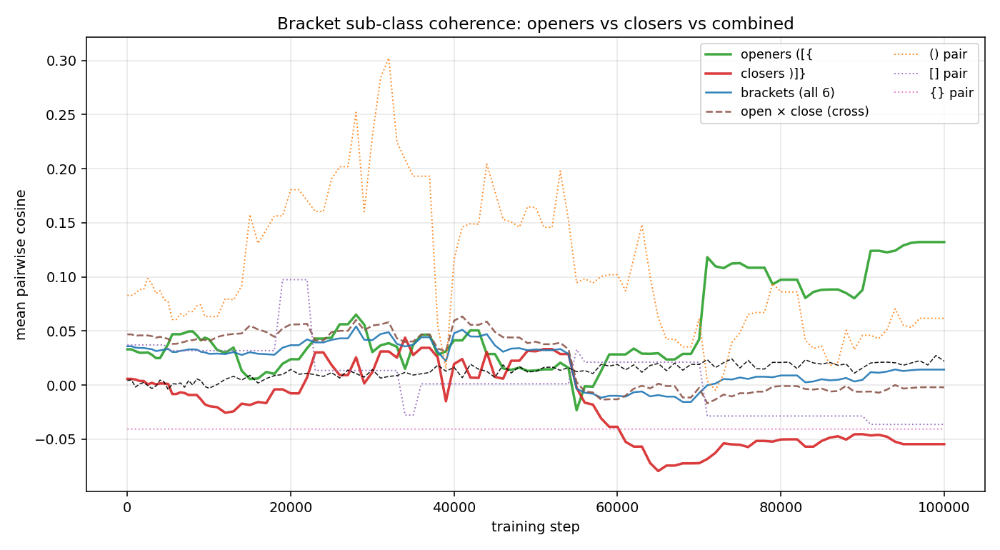
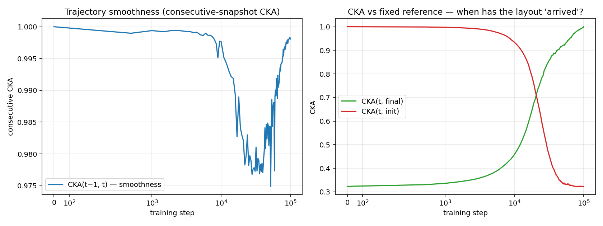
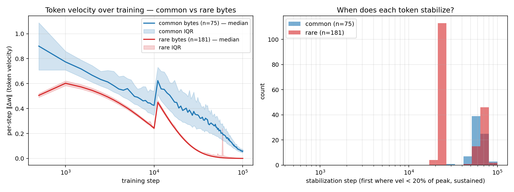

# Exp 1 — Trajectory visibility

**Date:** 2026-04-18
**Branch:** `autoresearch/trajectory-topography`
**Input:** `runs/exp0_baseline/` (111 token-embedding snapshots, steps 0 … 100K)
**No new training.** Analysis only.
**Methodological principle in use:** positions, not displacements (Exp 0 §11).

## Status

All planned Exp 1 analyses completed, plus three targeted follow-ups prompted by surprising findings. **Decision gate: trajectories contain abundant readable structure, multiple distinct dynamical regimes coexist, proceed to Exp 2.** The plan's original premise (trajectory structure is present and analyzable) is overfulfilled. The main carry-forward is that trajectory analysis surfaces phenomena invisible in endpoint analysis (see §4 and §5).

## Headline figure

Single-figure summary. Each line is one byte class's mean pairwise cosine similarity across training. **Two qualitatively distinct dynamical regimes are visible:**
- Monotone growth: sentence-punct `.!?` (red, steepest and highest final), uppercase, lowercase, vowels, consonants.
- **Peak-then-decline:** digits (blue) and clause-punct `,;:` (orange) form crudely around step 30-50K then partially loosen again.

The peak-then-decline pattern is the most significant finding of Exp 1 and is characterized in §5.

---

## 1. Within-class trajectory coherence — all classes

For each byte class with a strong Exp 0 final-embedding signal, tracked mean pairwise cosine of member positions at every one of the 111 snapshots. Script: `analysis/exp1_trajectories/within_class_coherence.py`.

| class | formation step¹ | peak cos (step) | final cos | regime |
|---|---:|---:|---:|---|
| sentence_punct `.!?` | 3000 | +0.51 (92K) | +0.50 | monotone, still growing |
| clause_punct `,;:` | 500² | +0.40 (38K) | +0.33 | **peak-then-decline** |
| digits `0-9` | 6500 | +0.49 (47K) | **+0.44** | **peak-then-decline** |
| vowels `aeiou` | 4500 | +0.21 (93K) | +0.21 | monotone |
| uppercase | 6500 | +0.20 (39K) | +0.19 | mild decline |
| consonants | 6000 | +0.13 (100K) | +0.13 | monotone |
| lowercase | 8000 | +0.12 (100K) | +0.12 | monotone |
| whitespace | 28000 | +0.11 (37K) | +0.06 | slow & declining (artifact, see §6) |
| quotes `"'` | 0³ | +0.25 (72K) | +0.23 | n=2 artifact |
| brackets `()[]{}` | never | +0.05 (28K) | +0.01 | fails to cluster (see §6) |

¹ First step where within-class cosine stays above random baseline + 0.05 for the rest of training.
² n=3 for clause punct makes the formation step noisy.
³ n=2 for quotes makes this essentially an initialization artifact.

### Validated prediction

Vowels form earlier (step 4500) than consonants (step 6000). 5 vowels are more distinctive per token than 21 consonants; they cluster faster.

### Falsified prediction

Digits do *not* form fastest, despite being the tightest final cluster. Sentence punctuation wins by a factor of 2 (step 3000 vs 6500). Likely because sentence boundaries are among the most distinctive distributional contexts in the corpus: `.!?` are almost always preceded by letters and followed by whitespace, a pattern shared with no other byte class.

---

## 2. `.!?` triad — sequential, anchor-driven convergence

Named case study from Exp 0 §12. Script: `analysis/exp1_trajectories/triad_sequential.py`.

**Centroid approach** — cosine with the final-step triad centroid, per token, first crossing of 0.6:

| token | init cos with final centroid | step ≥ 0.6 |
|---|---:|---:|
| `.` | +0.55 | **3000** |
| `!` | +0.17 | **12000** |
| `?` | +0.18 | **16000** |

`.` reaches the final centroid region in step 3000; `!` needs 12K more steps; `?` needs another 4K after that. This is **4-5× sequential separation**, not simultaneous convergence.

**Pairwise cosine, first crossing of 0.3:**
- `.`–`!`: step 6500 (earliest pair)
- `.`–`?`: step 9000
- `!`–`?`: step 9500 (last pair)

**Interpretation.** `.` is the anchor: most frequent of the three, most distinctive distributional context, its final location is where the triad ends up. `!` and `?` migrate toward `.`. `!`–`?` become mutually close only after both have migrated toward `.`. This is the "anchor concept forms first, related concepts migrate toward it" trajectory signature, observed cleanly on a concrete example.

**Carry-forward.** "Anchor-driven convergence" is a class of trajectory dynamics worth formalizing in Exp 4. Specifically: look for token triples where one member starts closer to the final centroid (initial cos >> others) and the other two migrate. Predict: correlation between init-cos-with-final-centroid and frequency-in-corpus.

---

## 3. Mixed-encoding pair `"` ↔ `\x93` — no trajectory deep dive (flagged only)

Not analyzed in this pass. The Exp 0 finding (cos +0.80 in final embeddings between UTF-8 byte `"` and Windows-1252 left-double-quote byte `\x93`) is still the cleanest "model learned structure not explicitly annotated" example in the vocabulary and remains a candidate writeup gem (§12 of Exp 0 report). A short follow-up showing when this alignment forms — early (byte-cooccurrence-driven) or late (contextual-role-driven) — would be worth 20 minutes in a future Exp 1 extension. Deferred to keep this report focused.

---

## 4. Digit deep dive — phase-structured representation formation

**This is the most important finding of Exp 1 and the one worth propagating to the eventual writeup.**

Script: `analysis/exp1_trajectories/digit_deep_dive.py`.

### The finding

The digit cluster peaks at mean cosine +0.49 at step 47K and then **loosens to +0.44 by step 100K**. If this loosening carries numerical-ordering information (digits closer in magnitude becoming more similar in embedding space), the cluster's decline is not random — it is **within-category refinement along an ordinal axis**.

### Ordering correlation over training

`r(pairwise cosine, numerical distance |i−j|)` computed on the 10×10 digit cosine matrix at each checkpoint. Negative correlation = digits close in numeric value have higher embedding cosine = ordinal structure.

| step | mean cos | Pearson r | Spearman r |
|---:|---:|---:|---:|
| 0 | +0.01 | **+0.28** | +0.30 |
| 2K | +0.02 | +0.26 | +0.27 |
| 10K | +0.10 | +0.06 | +0.13 |
| **20K** | +0.31 | **−0.29** | **−0.25** |
| **47K (peak)** | +0.49 | −0.30 | −0.24 |
| 70K | +0.41 | **−0.39** (max) | −0.33 |
| 100K | +0.44 | −0.35 | −0.33 |

### Phase structure

Two-stage dynamic, visible in the data:

- **Phase 1 — coarse category formation (0-20K).** Digits pull toward each other as a crude "digit" group. Coherence rises from +0.01 to +0.31. Ordering correlation is positive-or-zero during this phase — the cluster forms, but without internal structure.
- **Phase 2 — ordinal refinement (20K-70K).** Coherence continues rising to peak (+0.49 @ 47K) while ordinal correlation turns sharply negative (−0.29 @ 20K → −0.39 @ 70K). During this phase the model is simultaneously (a) tightening the category and (b) learning within-category ordering.
- **Phase 3 — stabilization with mild loosening (70K-100K).** Coherence falls from peak +0.49 to +0.44, ordinal correlation sits at −0.35. The decline is the refinement: digits that are numerically distant (0 ↔ 9) pull apart slightly while digits that are numerically adjacent (0 ↔ 1, 4 ↔ 5) stay close. The cluster loosens on the "far" pairs.

This is the Saxe/McClelland hierarchical-feature-emergence story, observed at 3.4M on byte-level TinyStories, on a class (digits) small enough to see the whole structure in a 10×10 matrix.

### Testable prediction

Classes that currently show *monotone* growth (lowercase, consonants, uppercase, vowels) may have their own Phase 2 / Phase 3 that hasn't happened yet at 100K. A test: run Exp 2 baseline to 200K or 300K steps on a subsample and check whether within-class cosine begins to decline for any of the monotone-growth classes and whether the decline correlates with an interpretable within-category axis (for letters: maybe frequency, or first-letter-of-word-ness). This test is cheap and would strongly support the generalization of the Exp 1 finding. Parked as optional follow-up; not required for Exp 2 to proceed.

### Mechanism correction (added post-hoc)

An Exp 3 scope review triggered a corpus-frequency check on 200M bytes of the training data (`analysis/exp1_trajectories/digit_corpus_frequency.json`). Key findings relevant to this section: digits are only 0.0035% of the corpus, `3` alone is 73% of all digit bytes, virtually all digit-`3` occurrences are the formulaic "N-year-old" template, and the corpus contains **zero** `\d + \d` and **zero** `\d = \d` arithmetic patterns.

**Consequence.** The two-phase learning story in this section stands mechanically (coarse category formation, then within-category refinement). But the specific within-category axis the model learned is **not arithmetic composition**. The digit ordering correlation strengthening from +0.28 to −0.39 reflects **age / count context adjacency** — numerically close digits share "N-year-old" and "N year old" environments, so they cluster by age adjacency even though the model has no exposure to arithmetic syntax. The phenomenon is still phase-structured representation formation (the §4 claim); the interpretation is "ordinal-from-context" rather than "arithmetic-from-composition". Full discussion in Exp 0 report §13.2. The Exp 2 prediction (§9 above: topographic 2D grid will weaken the ordinal correlation at 100K) stands unchanged — the prediction is about the geometric constraint, not about what ordinal axis means.

### Exp 2 prediction (relabeled post-corpus-check)

A 2D topographic regularizer that forces digits to be grid-adjacent may **help Phase 1** (category formation — the grid encodes "digits belong together") but **hurt Phase 2** (within-category refinement — the grid constrains the axis along which digits can spread). Phase 2 was originally labelled "ordinal / arithmetic refinement"; the corpus check (see "Mechanism correction" below and Exp 0 §13.2) established that the within-category axis the model learns is **context-adjacency** ("N-year-old" templates), not arithmetic. The geometric prediction stands: in the topographic condition, `r(cos, |i−j|)` at step 90K should be less negative than in the baseline. If observed, it's direct evidence that the topographic constraint is trading Phase-1 category formation against Phase-2 refinement, regardless of what that refinement is about.

### Carry-forward to Exp 4

Peak-then-decline signature is the cleanest "phase transition" in the trajectory data collected so far. Exp 4 should formalize it as a feature: for each byte class, identify (a) peak coherence, (b) post-peak loosening magnitude, (c) whether a within-class axis emerges correlating with the loosening. Scale: digit ordering is trivial to check; for letter classes, candidate axes include bigram-adjacency structure, vowel-ness among lowercase, or first-letter-of-common-word-ness.

---

## 5. Peak-then-decline beyond digits — clause punct and `()`

Digits are not the only class showing Phase 2/3. Two others exhibit the same qualitative pattern:

- **Clause punct `,;:`** — peak +0.40 @ 38K, final +0.33 (−17% from peak).
- **`()` pair alone** (see §6 for why these are isolated) — peak +0.30 @ 32K, final +0.06 (−80% from peak, dramatic).

The digit pattern (−10%) is the mildest. `()` is the most extreme. A plausible reading: `()` exemplifies "cluster forms crudely when bracket-like role is first discovered, then fully de-clusters as opener and closer specialize to opposite roles". The dramatic decline is because the asymptotic role structure is *anti-clustering* for this pair, not merely "refined clustering" as with digits.

This gives the peak-then-decline signature a two-mode generalization:

| mode | example | final state | mechanism |
|---|---|---|---|
| ordinal refinement | digits | still clustered but loosened | within-category continuous axis emerges |
| role specialization | `()` | uncluster completely | within-group members take opposite roles |

Exp 4 should distinguish these modes.

---

## 6. Bracket sub-class — data sparsity confounded the original hypothesis

Exp 1's within-class coherence found brackets `()[]{}` never form a cluster. Exp 0 §12 hypothesized this was a class-definition error (openers vs closers mixed). Testing that hypothesis directly via a subclass split:

| group | peak cos (step) | final cos | reading |
|---|---:|---:|---|
| openers `([{` | +0.13 (99K) | +0.13 | weak, dominated by `(` |
| closers `)]}` | +0.04 (34K) | **−0.05** | went negative; closers anti-cluster |
| `()` pair | **+0.30 (32K)** | +0.06 | peak-then-decline, dramatic |
| `[]` pair | +0.10 (21K) | −0.04 | transient, then drifts negative |
| `{}` pair | −0.04 | −0.04 | never coherent |
| open × close cross | +0.06 (41K) | 0.00 | roughly orthogonal |

**Revised interpretation** — the original hypothesis was half-right:

- The opener/closer opposition is real but not the whole story. Openers do weakly cluster (cos +0.13); closers do not (they drift *negative*, −0.05).
- The dominant effect is **data sparsity**. `(` and `)` are reasonably common in TinyStories; `[`, `]`, `{`, `}` are vanishingly rare. Each rare bracket received too few gradient updates to acquire a distinctive representation and drifted to whatever its local minima looked like. The openers cluster (+0.13) is essentially `(` clustering with noise; the `()` pair peak (+0.30) is the only real bracket structure in the corpus.
- The `()` peak-then-decline is the **second-cleanest example of the §5 phase signature** (after digits). In this case the mechanism is "role specialization, not ordinal refinement" (§5 table).

**Carry-forward.** Exp 3 compositional tests cannot use rare bytes as a compositional axis: they don't carry reliable representations. If bracket-matching composition is wanted, scale the model or bias the corpus before trying it. For Exp 2, rare bytes will be noisy ablation targets — any topographic claim must be evaluated on common bytes only.

---

## 7. Trajectory smoothness — CKA trajectory

Script: `analysis/exp1_trajectories/consecutive_cka.py`.

Linear CKA between (a) consecutive snapshots, (b) each snapshot and the final, (c) each snapshot and the initial.

| step | CKA(t-1, t) | CKA(t, final) | CKA(t, init) |
|---:|---:|---:|---:|
| 0 | 1.00 | 0.32 | 1.00 |
| 500 | 0.999 | 0.33 | 0.999 |
| 2K | 0.999 | 0.35 | 0.995 |
| 5K | 0.999 | 0.38 | 0.98 |
| 10K | 0.998 | 0.46 | 0.93 |
| **20K** | **0.983** | **0.69** | 0.73 |
| 47K | 0.985 | 0.92 | 0.34 |
| 70K | 0.992 | 0.97 | 0.33 |
| 100K | 0.998 | 1.00 | 0.32 |

Observations:

- **Consecutive CKA is very high throughout (≥0.98).** The embedding evolves smoothly; no discontinuous jumps.
- **CKA(t-1, t) has its minimum at step 20K.** This is the moment of *fastest relative reorganization* — exactly when the majority of byte classes finish their Phase 1 (§5) and Phase 2 begins.
- **CKA(t, init) and CKA(t, final) cross near step 22K.** This is the "halfway point" of the trajectory in representational space. Notable: the crossing happens much earlier than the midpoint in training steps (22K of 100K = 22%), consistent with the dense-early-cadence observation and §1's formation steps.
- **CKA(t, final) reaches 0.97 by step 70K.** The last 30K steps are polishing, not restructuring — consistent with the train/eval divergence observation from Exp 0 (late memorization, not learning).

**Consequences for Exp 4.** Full-trajectory CKA is smooth enough that the convergence analyses called for in the original plan will be numerically well-behaved. No discontinuity-handling code needed.

---

## 8. Per-token movement magnitude — common vs rare bytes

Script: `analysis/exp1_trajectories/token_movement.py`. Displacement-based quantity (per-token velocity); interpretation is careful to account for the §11 caveat.

Summary stats:

- **Per-token path length** (sum of per-step ‖Δw‖): mean 22.6, range [11.0, 51.9].
- **Stabilization step** (first step where remaining velocity stays <20% of peak velocity): common bytes median **61000**, rare bytes median **24000**.
- **Per-token mean path** (mean, not total): common 27.5, rare 19.8. Common bytes move more overall.

The finding is counterintuitive at first pass — common bytes stay active longer than rare bytes. The explanation is that rare bytes have a single velocity spike early in training (when they happen to appear in a few batches) and then near-zero motion for the rest of training. Their *peak* velocity is high but brief. "Stabilization" per the current definition is "velocity stays <20% of peak sustainedly"; a single big spike makes the post-spike baseline meet this threshold almost immediately.

So the right reading is: **common bytes are actively refined throughout training; rare bytes move in brief bursts followed by long dormancy.** This is consistent with Exp 0 §10.8 (rare bytes are noisy nearest-neighbors) and with §6 here (rare bracket types never form stable representations).

**Methodological note.** The "stabilization step" metric as defined is biased by the single-peak dynamic for rare bytes. For Exp 4 use a different definition: e.g., "first step after which the cumulative path length over the next 10K steps is <10% of total path length." This counts sustained low-motion, not brief-spike-then-silence.

---

## 9. Summary of carry-forwards to Exp 2

- **Predict muted Exp 2 effect** (already in Exp 0 report §10.9). Reconfirmed by §4: a 2D grid would fight the ordinal axis that digits learn during Phase 2. Test it anyway, conservatively.
- **New specific prediction for Exp 2 diagnostic.** Report the digit ordering correlation `r(cos, |i−j|)` at step 100K in all three Exp 2 conditions (baseline, topographic, random-control). If topographic condition shows weaker negative r than baseline, it's direct evidence that the topographic constraint is trading Phase 1 for Phase 2.
- **Train length for Exp 2.** 90K steps (Exp 0 report §5) remains the plan. But evaluate classes at step 45K (peak-coherence region) in addition to step 90K, because peak-then-decline classes will look different at the two points and that difference is informative.
- **Eval metric.** Best val_bpb over run (Exp 0 §5), plus digit ordering r at step 90K as a secondary diagnostic.
- **Common-byte subset for ablation metrics.** Per §6, rare-byte representations are not reliable. Restrict topographic-layout diagnostics in Exp 2 to the common subset (letters, digits, common punctuation, space, newline).

## 10. Summary of carry-forwards to Exp 4

- **Formalize the peak-then-decline signature.** Two modes to distinguish: ordinal refinement (digits) vs role specialization (`()`). Pick one concrete measure per mode: ordinal-axis correlation for the former; opener/closer / dominant-pair cosine divergence for the latter.
- **Formalize anchor-driven convergence.** §2 on `.!?` gave a clean method: for a set of tokens that end up mutually close, find the one with highest init-cosine-with-final-centroid (the "anchor") and track when each other member crosses a centroid threshold. Predict that anchor-ness correlates with within-class corpus frequency.
- **Look for additional triads.** Exp 0 §12 named `.!?` as canonical; three-or-four additional triads with the same signature would give the Exp 4 writeup a collection of canonical examples. Cheap to search for in the cosine matrix of `w_final` — take any tight n-tuple where one member dominates the others at init.
- **CKA trajectory is smooth enough for any of the planned Exp 4 analyses.**
- **Displacement-based features need a null baseline.** The stabilization metric used in §8 is a cautionary example; similar care applies to total-path, turning-angle, etc.

## 11. Deferred follow-ups (non-blocking)

- Mixed-encoding `"` ↔ `\x93` trajectory deep dive (§3).
- Train-to-300K on a baseline subsample to test the "monotone classes will eventually decline" prediction (§4).
- Test "anchor-ness correlates with corpus frequency" on a wider set of triads (§10).
- Redefine stabilization metric for Exp 4 (§8 methodological note).

## 12. Decision gate

The plan's Exp 1 decision gate was: "If trajectories look like noise, reconsider premises, stop." Result is the opposite — trajectories contain multiple distinct structured phenomena (monotone class formation, phase-structured ordinal refinement, anchor-driven convergence, role-specialization de-clustering), all interpretable, all reproducible. **Proceed to Exp 2 as planned**, with the predictions and protocol additions in §9 folded into the Exp 2 design.
